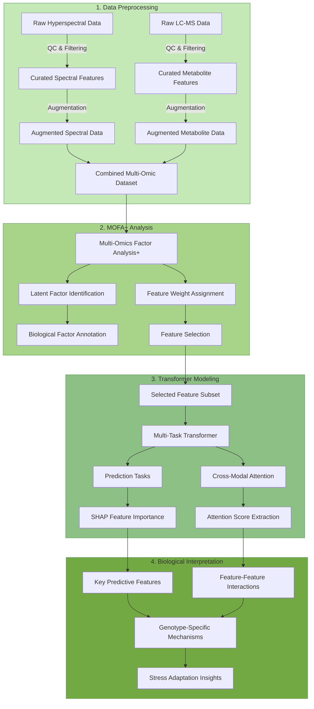
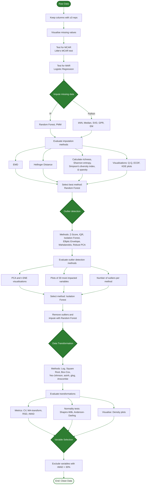
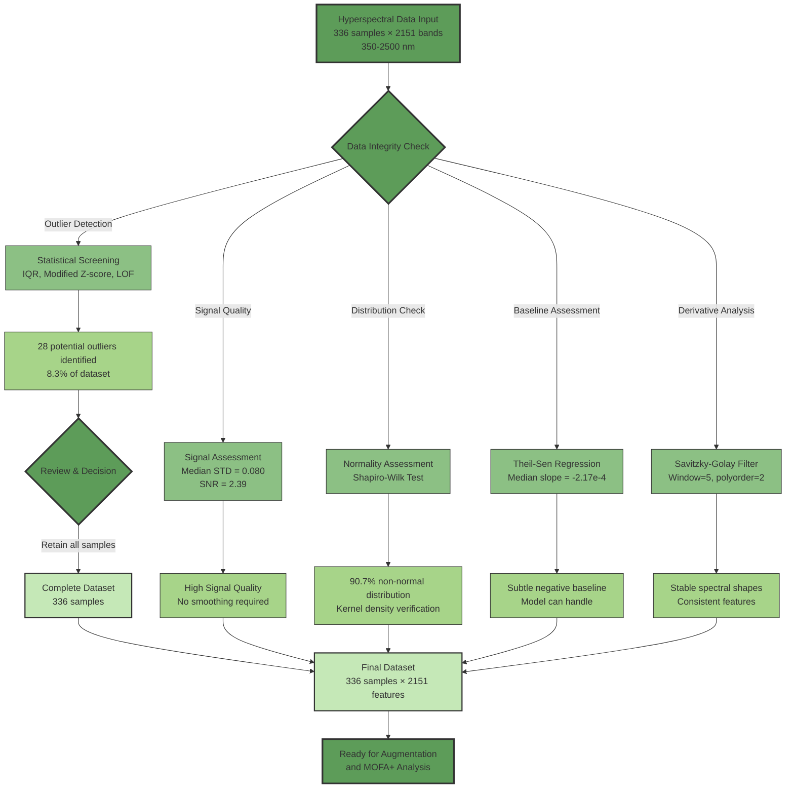
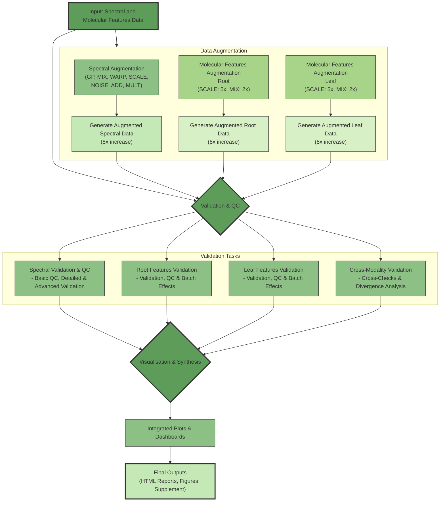

# MOFA+ Transformer


[](https://opensource.org/licenses/MIT)
[](https://www.python.org/)
[](https://pytorch.org/)
[](#citation)

## MOFA+ Transformer: An Interpretable Deep Learning Framework for Dynamic, Feature-Specific Multi-Omics Integration


## Overview

Multi-omics integration promises mechanistic insight, but most pipelines—correlation matrices, latent-variable models, and off-the-shelf deep nets—struggle to resolve the feature-specific, time-resolved, and asymmetric (predictive) relationships that drive biological responses.

**MOFA+ Transformer** addresses this by pairing unsupervised variance decomposition (MOFA+) with a cross-modal Transformer that reveals **when** and **how** specific feature pairs (e.g., spectral–metabolite) coordinate during stress adaptation.

### How It Works

1. **MOFA+** first organises variation into interpretable latent factors across data views (e.g., hyperspectral reflectance and LC-MS metabolomics)
2. Those factors guide feature selection for a **Transformer** whose cross-attention mechanism provides quantitative, feature-pair interaction scores—both overall and condition-specific (by genotype, treatment, timepoint)
3. **SHAP analysis** contrasts variance-driving (MOFA+) and prediction-driving (model) features, revealing where mechanistic and predictive insights converge or diverge

This dual-discovery approach enables you to trace which specific feature pairs drive biological outcomes and when they activate during the response trajectory.

### What's Included

This repository contains the **complete, reproducible implementation**:
- **Data preprocessing** → **MOFA+ decomposition** → **Transformer training + attention/SHAP analysis** → **Figure generation**
- Step-by-step `REPRODUCE_*.md` guides aligned to manuscript sections
- All analysis scripts organised by pipeline stage
- Validation on independent HyperSeq single-cell dataset (GEO: GSE254034)

> **Note:** Attention and SHAP expose asymmetric, predictive associations; they are not causal by themselves. Establishing causality requires additional experimental validation.

## 🔍 Abstract

Multi-omics studies often capture co-variation but struggle to resolve the asymmetric, time-resolved feature relationships that underpin biological responses. We present MOFA+ Transformer, an interpretable deep learning framework coupling variance decomposition (MOFA+) with cross-modal Transformer attention to quantify which specific feature pairs drive biological outcomes and when. A key innovation is explicitly contrasting variance-driving features (MOFA+) with prediction-driving features (SHAP), revealing largely distinct sets with complementary mechanistic insights. In time-series wheat osmotic stress integrating hyperspectral physiology with LC-MS metabolomics, tolerance reflects the timing and architecture of spectral-to-metabolite coordination rather than abundance per se, with 3.6-fold stronger coordination in tolerant genotypes at peak stress (FDR < 3.2×10⁻⁴). In an independent single-cell imaging-transcriptomics dataset (HyperSeq; human cells), we validate a non-linear link between cellular autofluorescence and the stress-related lncRNA NEAT1 (permutation p = 0.0099; Cohen's d = 1.14) undetectable by simple correlation (r = −0.023). MOFA+ Transformer yields testable, mechanism-centred hypotheses across data modalities, biological scales, and organisms whilst remaining interpretable.

## ✨ Key Contributions & Highlights

### 🔬 Methodological Innovations

**Interpretable Deep Learning for Multi-Omics**  
Pairs MOFA+ (unsupervised variance decomposition) with Transformer cross-attention to move beyond static correlation and expose asymmetric, predictive, time-resolved feature-pair relationships.

**Feature-Pair Granularity**  
Quantifies specific cross-modal pairs (e.g., spectral wavelength `565 nm` → metabolite `N_1909`) so you can generate targeted, testable hypotheses.

**Temporal Coordination Networks**  
Shows that tolerance relates to when and how cross-modal coordination turns on: tolerant genotypes exhibit approximately 3.6× stronger coordination at peak stress and earlier onset (root first, then leaf).

**Dual-Perspective "Importance"**  
Integrates variance-driving features (MOFA+) with prediction-driving features (SHAP). Their limited overlap (Jaccard ≈ 0.02–0.18) highlights complementary biological insights and pinpoints robust biomarkers where they converge.

> **Note:** Attention/SHAP reveal asymmetric, predictive associations; they are not causal by themselves.

---

### 🎯 Key Discoveries

| Discovery | Evidence (Summary) |
|-----------|-------------------|
| **Early Response Hypothesis** | Tolerant lines show approximately 2.5× stronger coordination at initial stress (BH-FDR < 3.2×10⁻⁴) |
| **Tissue-Specific Strategies** | Leaf: approximately 355% stronger coordination in tolerant vs susceptible at peak stress; Root: approximately 39% weaker (distinct strategy) |
| **Spectral "Sweet Spot"** | 546–635 nm band repeatedly flagged by MOFA+ and SHAP (Jaccard ≈ 0.18) |
| **Non-Linear Single-Cell Link** | Cellular autofluorescence → NEAT1 association in HyperSeq (p = 0.0099, Cohen's d ≈ 1.14); invisible to simple correlation (r ≈ −0.023) |

---

### 📊 Dataset Scale & Evaluation

**Primary (Wheat Osmotic Stress)**
- 336 raw samples → 2,688 training/validation via augmentation (7 QC reports: `SR1–SR7.html`); test set uses only original samples
- 2,151 spectral features + 2,471 molecular features after curation
- Approximately 11 active MOFA+ factors capturing genotype, treatment and time
- MOFA+-guided subset (approximately 500 features total; e.g., approximately 519 in manuscript config)
- Metrics logged to `model_performance_summary.csv` on the held-out original test set

**Independent Validation (HyperSeq Single-Cell)**
- GEO: GSE254034 (paired imaging-transcriptomics, human cells)
- Recovers stress/metabolism signal (e.g., *HSPA6*, *COX6C*); validates NEAT1 link (permutation p = 0.0099, d ≈ 1.14)

---

### ✅ Reproducibility & Rigour

- **End-to-end scripts**: Raw data → preprocessing → MOFA+ → Transformer → figures (`REPRODUCE_01–05`)
- **Statistical validation**: BH-FDR throughout; permutation tests for single-cell validation; bootstrap stability (e.g., approximately 96% feature retention)
- **Exact train/val/test splits** and environment files included

> **Bottom Line:** MOFA+ Transformer shifts multi-omics from *"what co-varies"* to *"which features predictively coordinate, when, and how strongly"*—yielding testable, mechanism-centred hypotheses with quantified evidence.

## 🛠️ Framework Workflow



## 🗂️ Repository Structure
```
📦 mofa_transformer_osmotic_stress/
 ├── 📂 1_data_preprocessing/
 │   ├── 📄 REPRODUCE_01_preprocessing.md     # Reproducibility guide for preprocessing
 │   ├── 📂 01_augmentation/
 │   │   ├── 📜 aug_mol_features.py            # Augments molecular feature datasets.
 │   │   ├── 📜 aug_spectral_data.py           # Augments spectral datasets.
 │   │   ├── 📜 verify_augmentation.py         # Verifies data augmentation process.
 │   │   ├── 📜 sr5.py                         # Validates cross-modality augmentation consistency.
 │   │   ├── 📜 sr6_7.py                       # Analyses statistical divergence for augmented data.
 │   │   ├── 📜 run_augmentation.py            # Main pipeline for data augmentation.
 │   │   ├── 📜 sr3_4.py                       # QC for augmented molecular feature data.
 │   │   ├── 📜 qc_aug_spectral.py             # QC for augmented spectral data.
 │   │   ├── 📜 plot_spectral_aug_qc.py        # Plots for spectral augmentation QC results.
 │   │   ├── 📜 sr1.py                         # HTML reports for spectral augmentation QC.
 │   │   ├── 📜 validate_mol_aug_batch.py      # Validates batch effects in molecular feature augmentation.
 │   │   └── 📜 sr2.py                         # Advanced validation of spectral data augmentation.
 │   │
 │   ├── 📂 02_misc_processing/
 │   │   ├── 📜 metadata_tools.py              # Tools for metadata analysis and manipulation.
 │   │   └── 📜 spectral_qc.py                 # Hyperspectral data quality assessment pipeline.
 │   │
 │   ├── 📂 03_lcms_preprocessing/
 │   │   ├── 📜 dim_reduce_outliers.py         # Outlier analysis for metabolomics data via dimensionality reduction.
 │   │   ├── 📜 diversity_metrics.py           # Imputation quality assessment using diversity metrics.
 │   │   ├── 📜 feature_filter.py              # Column filtering for metabolomics data QC.
 │   │   ├── 📜 impute_dist_check.py           # Imputation validation: distribution checks.
 │   │   ├── 📜 impute_validate.py             # Imputation validation: visualisation script.
 │   │   ├── 📜 isolation_forest.py            # Outlier detection and removal using Isolation Forest.
 │   │   ├── 📜 logistic_test.py               # Logistic regression results: analysis and visualisation for MAR.
 │   │   ├── 📜 mar_test.py                    # Missing At Random (MAR) analysis for metabolomics data.
 │   │   ├── 📜 mcar_test.py                   # Little's MCAR (Missing Completely At Random) test.
 │   │   ├── 📜 median_impute.py               # Median-based missing value imputation.
 │   │   ├── 📜 missing_vis.py                 # Missing data visualisation for metabolomics data.
 │   │   ├── 📜 ml_impute.py                   # Advanced missing value imputation using ML methods.
 │   │   ├── 📜 normality_test.py              # Normality testing for metabolomics data.
 │   │   ├── 📜 normality_vis.py               # Normality test visualisation for data transformations.
 │   │   ├── 📜 outlier_vis.py                 # Outlier imputation impact analysis and visualisation.
 │   │   ├── 📜 rf_impute.r                    # Random Forest imputation.
 │   │   ├── 📜 transform_data.py              # Data transformation script for metabolomics analysis.
 │   │   ├── 📜 transform_eva.py               # Transformation evaluation script for metabolomics data.
 │   │   ├── 📜 transform_metrics.py           # Metabolomics data transformation: evaluation metrics.
 │   │   └── 📜 variance_calc.py               # rMAD-based variable selection for metabolomics.
 │   │
 │   └── 📂 04_utilities/
 │       └── 📜 colour_utils.py                # Utility functions for colour handling in plots.
 │
 ├── 📂 2_analysis/
 │   ├── 📄 REPRODUCE_02_mofa.md               # Reproducibility guide for MOFA+ analysis
 │   ├── 📄 REPRODUCE_03_transformer.md        # Reproducibility guide for Transformer analysis
 │   ├── 📄 REPRODUCE_04_hyperseq.md           # Reproducibility guide for HyperSeq validation
 │   │
 │   ├── 📂 01_mofa_plus/
 │   │   ├── 📜 viz_mofa_results.py            # Enhanced MOFA+ results visualisation.
 │   │   ├── 📜 viz_mofa_results.txt           # Launcher script for viz_mofa_results.py.
 │   │   ├── 📜 mofa_bootstrap.py              # MOFA+ bootstrap stability analysis.
 │   │   ├── 📜 mofa_permutation_test.py       # MOFA+ permutation test for factor-metadata association.
 │   │   ├── 📜 run_mofa_analysis.py           # Main script for MOFA+ analysis and validation.
 │   │   └── 📜 select_mofa_features.py        # MOFA+ feature selection script.
 │   │
 │   ├── 📂 02_transformer_model/
 │   │   ├── 📜 analyse_transformer_shap.py    # SHAP analysis for multi-omic transformer (feature attention).
 │   │   ├── 📜 plot_transformer_attention.py  # Multi-wavelength attention analysis for plant stress.
 │   │   ├── 📜 process_attention_data.py      # Process raw attention data from transformer.
 │   │   ├── 📜 transformer_model.py           # Multi-omic Transformer model implementation.
 │   │   ├── 📜 train_transformer_knn.py       # Trains Transformer (v2b) and compares with KNN.
 │   │   └── 📜 train_transformer_attn.py      # Trains Transformer (v3) with feature attention.
 │   │
 │   ├── 📂 03_transformer_summary_and_evaluation/
 │   │   ├── 📜 summarise_mofa.py              # Summarises MOFA+ analysis results.
 │   │   ├── 📜 count_mofa_features.py         # Counts MOFA+ selected features.
 │   │   ├── 📜 aggregate_model_perf.py        # Aggregates predictive model performance metrics.
 │   │   ├── 📜 process_shap_results.py        # Processes SHAP analysis results.
 │   │   ├── 📜 analyse_mofa_shap_overlap.py   # Calculates and plots MOFA+ vs SHAP feature overlap.
 │   │   ├── 📜 analyse_view_attn_stats.py     # Analyses view-level attention statistics from Transformer.
 │   │   └── 📜 analyse_feature_attn.py        # Analyses conditional feature-level attention from Transformer.
 │   │
 │   └── 📂 04_hyperseq_validation/
 │       ├── 📜 1_mofa_decomposition.py        # MOFA+ factor analysis on HyperSeq dataset.
 │       ├── 📜 2_train_transformer.py         # Train cross-attention model with permutation test.
 │       ├── 📜 3_process_attention.py         # Process raw attention tensors from HDF5.
 │       ├── 📜 4_prepare_visualization_data.py # Extract and compute statistics for Figure 8 plots.
 │       └── 📜 utils_inspect_outputs.py       # Optional diagnostic utility for HDF5/Feather inspection.
 │
 ├── 📂 3_visualisation/
 │   ├── 📄 REPRODUCE_05_visualization.md      # Reproducibility guide for figure generation
 │   │
 │   ├── 📂 01_main_figures/
 │   │   ├── 📜 Figure_1.py                    # MOFA+ variance decomposition and factor annotation.
 │   │   ├── 📜 Figure_1.txt                   # Launcher script for Figure 1.
 │   │   ├── 📜 Figure_2.py                    # SHAP predictive importance analysis.
 │   │   ├── 📜 Figure_3.py                    # Cross-modal attention networks and statistics.
 │   │   ├── 📜 Figure_4_a-b.py                # Attention heatmaps (Panels A-B).
 │   │   ├── 📜 Figure_4_c.py                  # Network coordination landscapes (Panel C).
 │   │   ├── 📜 Figure_5.py                    # Model performance and biomarker identification.
 │   │   ├── 📜 Figure_6.py                    # Temporal dynamics and MOFA+/SHAP complementarity.
 │   │   ├── 📜 Figure_7_a-b.py                # Predictive feature clustering (Panels A-B).
 │   │   ├── 📜 Figure_7_c-g.py                # Tissue-task predictive importance (Panels C-G).
 │   │   └── 📜 Figure_8.py                    # HyperSeq validation: generalisability demonstration.
 │   │
 │   └── 📂 02_supplementary_figures/
 │       ├── 📜 Fig_S1.mmd                     # LCMS data processing flowchart (Mermaid diagram).
 │       ├── 📜 Fig_S2_3_5.py                  # Cross-modal attention dynamics and biomarkers (S2, S3, S5).
 │       ├── 📜 Fig_S4.py                      # Transformer performance metrics.
 │       ├── 📜 Fig_S6-7.py                    # LC-MS quality control and preprocessing.
 │       ├── 📜 Fig_S8.py                      # Hyperspectral data quality assessment.
 │       ├── 📜 Fig_S9.mmd                     # Data augmentation pipeline (Mermaid diagram).
 │       ├── 📜 Fig_S10-13.py                  # Augmentation validation and quality assessment.
 │       └── 📜 Fig_S14.py                     # MOFA+ cross-view integration network.
 │
 ├── 📂 data/
 │    ├── 📄 hyper_full_w.csv                   # Hyperspectral reflectance data (336 samples × 2,151 wavelengths, 350-2500 nm)
 │    ├── 📄 n_p_l2.csv                         # Leaf molecular features (N + P ionization modes)
 │    ├── 📄 n_p_r2.csv                         # Root molecular features (N + P ionization modes)
 │    └── 📜 README.md                         # Data files description, format, and origin
 │
 │
 ├── 📂 html/                                 # HTML reports.
 │       ├── 📜 SR1.html                      # Spectral Quality Control Report.
 │       ├── 📜 SR2.html                      # Advanced Spectral Validation Report.
 │       ├── 📜 FSR3.html                     # Molecular Feature Leaf Quality Control Report.
 │       ├── 📜 FSR4.html                     # Molecular Feature Root Quality Control Report.
 │       ├── 📜 FSR5.html                     # Cross-Modality Validation Report.
 │       ├── 📜 SR6.html                      # Divergence Analysis Reports.
 │       ├── 📜 SR7.html                      # Molecular Feature Batch Effect Validation.
 │       └── 📜 plots                         # Plot associated with the above 7 reports.
 │
 ├── 📜 README.md                             # Project overview, setup, how to run, citation, and SR mapping.
 └── 📜 requirements.txt                      # Pip requirements file (can be generated from conda env).
```

---


## 🗄️ Data Availability

### GitHub Data
This repository includes the core preprocessed input files in the `data/` directory:
- `hyper_full_w.csv`: Hyperspectral reflectance data (336 samples × 2,151 wavelengths)
- `n_p_l2.csv`: Leaf molecular features (336 samples × 1,418 features)
- `n_p_r2.csv`: Root molecular features (336 samples × 1,721 features)

See `data/README.md` for detailed file descriptions and metadata information.

### Raw Data Repository
**Raw data has been deposited to MetaboLights; the permanent accession will be provided upon acceptance (accession pending during review).**

🔗 **MetaboLights Repository**: https://www.ebi.ac.uk/metabolights/

The MetaboLights repository contains:
- Raw LC-MS data files (.raw format)
- Complete sample metadata and experimental protocols
- Full instrumental method files

---

## 📖 Reproducibility Documentation

**Complete step-by-step guides for manuscript reproduction:**

1. **REPRODUCE_01_preprocessing.md** → Data preprocessing (LC-MS, spectral QC, augmentation)
2. **REPRODUCE_02_mofa.md** → MOFA+ factor analysis and feature selection
3. **REPRODUCE_03_transformer.md** → Transformer training and interpretability analysis
4. **REPRODUCE_04_hyperseq.md** → External validation on HyperSeq dataset
5. **REPRODUCE_05_visualization.md** → Figure generation

**Execution order**: Follow documents sequentially (01 → 02 → 03 → 04 → 05)


*Raw data is archived at [repository link] (see `data/README` for download script)*

## 🚀 Installation

```bash
# Clone the repository
git clone https://github.com/shoaibms/mofa_transformer.git
cd mofa_transformer

# Create a conda environment
conda create -n mofa_transformer python=3.10
conda activate mofa_transformer

# Install dependencies
pip install -r requirements.txt

# Install package in development mode
pip install -e .
```

## 📊 Applications and Use Cases

The MOFA+ Transformer framework is designed for broad applicability across biological systems requiring multi-omics integration:

### Primary Demonstration: Plant Osmotic Stress
Our comprehensive validation used wheat genotypes under controlled osmotic stress conditions, including:

- **Tissue Types**: Root and Leaf
- **Stress Treatments**: Acute (Batch 1) and Mild prolonged (Batch 2) osmotic stress
- **Genotypes**: G1 (drought-tolerant) and G2 (drought-susceptible)
- **Time Points**: Days 1, 2, and 3 (representing early, intermediate, and late adaptation phases)
- **Data Types**:
  - Hyperspectral reflectance (350-2500 nm, 2,151 wavelengths)
  - Untargeted metabolomics (1,721 molecular features in root, 1,418 in leaf)

### Independent Validation: Single-Cell Multi-Omics
Framework generalisability confirmed on the HyperSeq dataset, demonstrating:
- Discovery of novel links between cellular phenotypes and molecular features
- Statistical validation of attention patterns (p=0.0099)
- Non-linear relationship detection beyond standard correlation methods

### Broader Applications
The framework's interpretable, dynamic approach makes it suitable for:
- **Clinical Research**: Patient stratification and treatment response prediction
- **Cancer Biology**: Tumour heterogeneity and therapeutic target identification
- **Environmental Science**: Ecosystem response coordination analysis
- **Biotechnology**: Pathway engineering optimisation
- **Developmental Biology**: Temporal coordination during development

## 🧬 Data Preprocessing Pipeline

### Metabolomic Data Quality Assessment and Preprocessing

Before analysis, we performed rigorous quality assessment of the untargeted LCMS data to ensure data integrity while preserving biologically relevant signals:



### Spectral Data Quality Assessment and Preprocessing

Rigorous quality assessment was performed on the hyperspectral data to ensure data integrity while preserving biologically relevant signals:



### Data Augmentation Workflow

To enhance statistical power for deep learning analysis, we developed a specialised data augmentation pipeline that expanded our dataset while preserving biological signals and relationships:



### Data Preprocessing Summary

- **Metabolomic Data**: Missing value analysis, Random Forest imputation, outlier detection via Isolation Forest, and asinh transformation
- **Spectral Data**: Quality assessment using robust statistical methods (IQR, Modified Z-score, Local Outlier Factor), signal quality analysis (Median STD=0.080), and normality assessment (90.7% non-normal)
- **Augmentation**: 8-fold increase using spectral methods (GP, MIX, WARP, SCALE, NOISE, ADD, MULT) and metabolomic methods (SCALE: 5x, MIX: 2x)

## 🔧 Software Stack

| Package | Version |
|---------|---------|
| PyTorch | 2.6.0 |
| MOFApy 2 | 0.7.2 |
| scikit-learn | 1.6.1 |
| pandas | 2.2.3 |
| shap | 0.47.1 |
| networkx | 3.4.2 |
| matplotlib / seaborn | 3.10.1 / 0.13.2 |

A full, frozen dependency list is in `requirements.txt`.

## 📦 Data Augmentation Validation Reports


- [SR1: Spectral Quality Control Report](https://htmlpreview.github.io/?https://github.com/shoaibms/mofa_transformer/blob/main/html/SR1.html)
- [SR2: Advanced Spectral Validation Report](https://htmlpreview.github.io/?https://github.com/shoaibms/mofa_transformer/blob/main/html/SR2.html)
- [SR3: Molecular Feature Leaf Quality Control Report](https://htmlpreview.github.io/?https://github.com/shoaibms/mofa_transformer/blob/main/html/SR3.html)
- [SR4: Molecular Feature Root Quality Control Report](https://htmlpreview.github.io/?https://github.com/shoaibms/mofa_transformer/blob/main/html/SR4.html)
- [SR5: Cross-Modality Validation Report](https://htmlpreview.github.io/?https://github.com/shoaibms/mofa_transformer/blob/main/html/SR5.html)
- [SR6: Divergence Analysis Reports](https://htmlpreview.github.io/?https://github.com/shoaibms/mofa_transformer/blob/main/html/SR6.html)
- [SR7: Molecular Feature Batch Effect Validation](https://htmlpreview.github.io/?https://github.com/shoaibms/mofa_transformer/blob/main/html/SR7.html)

These reports can also be accessed via GitHub at [https://github.com/shoaibms/mofa_transformer/tree/main/reports](https://github.com/shoaibms/mofa_transformer/tree/main/html)

## 📜 License

This project is released under the MIT License.

## ✉️ Contact

**Lead Developer:** Shoaib M. Mirza – shoaibmirza2200@gmail.com

**Project Repository:** [https://github.com/shoaibms/mofa_transformer](https://github.com/shoaibms/mofa_transformer)

## 🙏 Acknowledgments

- This work was supported by Agriculture Victoria Research
- We thank the HyperSeq dataset authors for making their data publicly available

