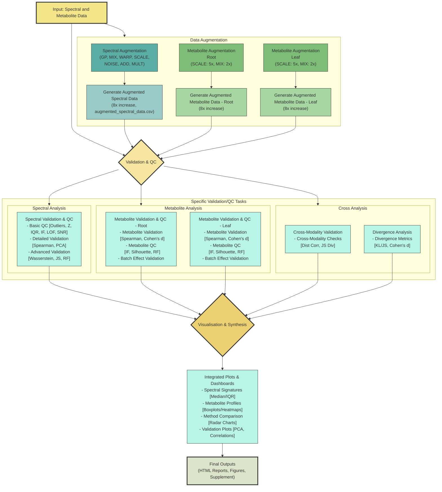
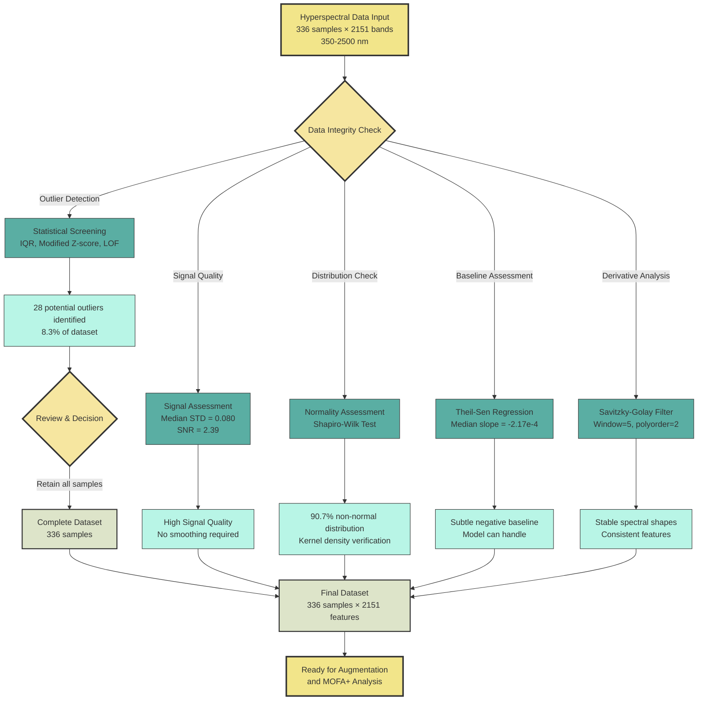

# MOFA+ Transformer


## An Interpretable Deep Learning Framework for Elucidating Dynamic Spectral-Metabolomic Relationships in Plant Osmotic Stress Adaptation

<p align="center">
  
</p>

## Overview

This repository contains the implementation of MOFA+ Transformer, a novel interpretable deep learning framework for multi-omics integration, designed to uncover dynamic relationships between spectral reflectance and metabolomic data in plant stress responses. By combining unsupervised variance decomposition (MOFA+) with attention-based deep learning (Transformer), this framework provides mechanistic insights into how plants coordinate physiological and biochemical processes during adaptation to osmotic stress.

### Key Features

- **Interpretable Cross-Modal Integration**: Quantifies directed associations between physiological (spectral) and biochemical (metabolomic) features
- **Dynamic Temporal Analysis**: Reveals how genotype-specific cross-modal networks evolve over time under stress
- **Tissue-Specific Insights**: Differentiates coordination strategies in leaf and root tissues
- **Feature Selection Pipeline**: Identifies biologically meaningful features across multiple modalities
- **Prediction + Interpretation**: Achieves high accuracy while maintaining interpretability for hypothesis generation

## Publication

> **MOFA+ Transformer: An Interpretable Deep Learning Framework for Elucidating Dynamic Spectral-Metabolomic Relationships in Plant Osmotic Stress Adaptation**
>
> *Under review*

## Repository Structure

```
mofa_transformer/
├── code/
│   ├── mofa/                 # Multi-Omics Factor Analysis+ implementation
│   ├── transformer/          # Cross-attention transformer architecture
│   ├── preprocessing/        # Data preprocessing and quality control
│   ├── augmentation/         # Data augmentation techniques
│   └── visualization/        # Visualization utilities
├── data/
│   ├── raw/                  # Raw spectral and metabolomic data
│   ├── processed/            # Preprocessed datasets
│   └── augmented/            # Augmented datasets
├── notebooks/
│   ├── 01_data_preprocessing.ipynb
│   ├── 02_data_augmentation.ipynb
│   ├── 03_mofa_analysis.ipynb
│   ├── 04_transformer_training.ipynb
│   └── 05_attention_analysis.ipynb
├── results/
│   ├── mofa/                 # MOFA+ outputs and factor analysis
│   ├── transformer/          # Trained models and predictions
│   ├── attention/            # Attention weights and analysis
│   └── figures/              # Generated figures
├── docs/
│   ├── tutorial.md           # Usage tutorial
│   └── api_reference.md      # API documentation
├── html/                     # HTML validation reports
├── README.md
├── requirements.txt
└── setup.py
```

## Installation

```bash
# Clone the repository
git clone https://github.com/shoaibms/mofa_transformer.git
cd mofa_transformer

# Create a conda environment
conda create -n mofa_transformer python=3.10
conda activate mofa_transformer

# Install dependencies
pip install -r requirements.txt

# Install package in development mode
pip install -e .
```

## Quick Start

### 1. Data Preprocessing

```python
from mofa_transformer.preprocessing import preprocess_spectral, preprocess_metabolomic

# Preprocess spectral data
spectral_processed = preprocess_spectral("data/raw/hyper_full_w.csv", 
                                         outlier_methods=["iqr", "zscore", "lof"])

# Preprocess metabolomic data
metabolomic_processed = preprocess_metabolomic("data/raw/n_p_l2.csv", 
                                              transform="asinh", 
                                              imputation="random_forest")
```

### 2. Run MOFA+ Analysis

```python
from mofa_transformer.mofa import MOFA_Integration

# Initialize MOFA+ model
mofa_model = MOFA_Integration(views=["leaf_spec", "root_spec", "leaf_met", "root_met"],
                              num_factors=20, 
                              ard_weights=True)

# Train MOFA+ model
mofa_model.train(data_dict, 
                 convergence_mode="medium", 
                 save_path="results/mofa/")

# Extract factors and weights
factors = mofa_model.get_factors()
weights = mofa_model.get_weights()
```

### 3. Train Transformer Model

```python
from mofa_transformer.transformer import MOFATransformer

# Initialize Transformer with MOFA+ selected features
transformer = MOFATransformer(mofa_features=selected_features,
                             embedding_dim=64,
                             num_heads=4,
                             dropout=0.1)

# Train model
transformer.train(train_loader, 
                 val_loader, 
                 epochs=150, 
                 lr=5e-5,
                 early_stopping=15)
```

### 4. Analyze Cross-Modal Attention

```python
from mofa_transformer.attention import AttentionAnalyzer

# Extract and analyze attention weights
attention_analyzer = AttentionAnalyzer(transformer)
s2m_attention = attention_analyzer.get_spectral_to_metabolite_attention()

# Visualize genotype-specific networks
attention_analyzer.plot_attention_network(
    condition="T1_D3", 
    genotype="G1", 
    tissue="Leaf",
    top_n=50
)
```

## Dataset

Our study used a comprehensive dataset designed to capture diverse osmotic stress responses, including:

- **Tissue Types**: Root and Leaf
- **Stress Treatments**: Acute (Batch 1) and Mild prolonged (Batch 2) osmotic stress
- **Genotypes**: G1 (drought-tolerant) and G2 (drought-susceptible)
- **Time Points**: Days 1, 2, and 3
- **Data Types**:
  - Hyperspectral reflectance (350-2500 nm, 2151 wavelengths)
  - Untargeted metabolomics (1721 features in root, 1418 in leaf)

The data is available in the `data/` directory. See the [data documentation](docs/data.md) for details on the experimental design and data structure.

## Data Augmentation and Preprocessing Pipeline

### Data Augmentation Workflow



### Spectral Data Quality Assessment and Preprocessing



## Key Results

<p align="center">
  
</p>

Our analysis revealed:

1. **Different integration strategies between genotypes**: The tolerant genotype (G1) establishes stronger, earlier cross-modal coordination
2. **Tissue-specific mechanisms**: Leaves and roots employ distinct spectral-metabolite relationships
3. **Temporal dynamics**: Coordination patterns evolve during stress, with G1 establishing key links by Day 2
4. **Specialized hub metabolites**: Central coordinators differ between genotypes (e.g., N_1909 in G1 leaves vs. N_3029 in G2 leaves)

## Citation

If you use this code or methodology in your research, please cite our paper:

```
@article{mofa_transformer2025,
  title={MOFA+ Transformer: An Interpretable Deep Learning Framework for Elucidating Dynamic Spectral-Metabolomic Relationships in Plant Osmotic Stress Adaptation},
  author={Author, A. and Author, B. and Author, C.},
  journal={Journal Name},
  year={2025},
  publisher={Publisher Name}
}
```

## Validation Reports

Detailed HTML validation reports are available in the `html/` directory:

- [Spectral Quality Control](html/integrated_qc_report_enhanced.html)
- [Advanced Spectral Validation](html/advanced_validation_summary_spectra.html)
- [Metabolite Leaf Quality Control](html/integrated_qc_report_leaf.html)
- [Metabolite Root Quality Control](html/integrated_qc_report_root.html)
- [Cross-Modality Validation](html/cross_modality_report_main_pipeline.html)
- [Divergence Analysis](html/divergence_summary.html)

## Reproducibility

The repository includes all code and documentation needed to reproduce our results. See the notebooks in the `notebooks/` directory for step-by-step workflows.

## Contributing

Contributions are welcome! Please feel free to submit a Pull Request.

1. Fork the repository
2. Create your feature branch (`git checkout -b feature/amazing-feature`)
3. Commit your changes (`git commit -m 'Add some amazing feature'`)
4. Push to the branch (`git push origin feature/amazing-feature`)
5. Open a Pull Request

## License

This project is licensed under the MIT License - see the LICENSE file for details.

## Acknowledgments

- This work was supported by [funding agencies/grant numbers]
- The MOFA+ implementation builds upon the original work by Argelaguet et al.
- We thank [acknowledgments] for their valuable feedback and support.

## Contact

For questions or support, please open an issue or contact [email].
