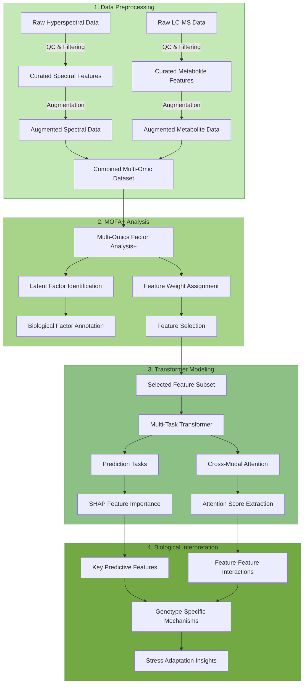

# MOFA+ Transformer


[](https://opensource.org/licenses/MIT)
[](https://www.python.org/)
[](https://pytorch.org/)

**MOFA+ Transformer** is an interpretable multi-omics framework that links unsupervised latent-factor structure with Transformer cross-modal attention and SHAP attribution to quantify feature-pair coordination across longitudinal biological data.

> **Manuscript status:** citation and DOI will be added after publication/release.

---

## Overview

Multi-omics studies can identify broad patterns of co-variation, but they often do not resolve which specific cross-modal relationships change, when they change, and whether those relationships are relevant for prediction. MOFA+ Transformer addresses this gap by combining:

1. **MOFA+ latent-factor decomposition** to organise shared and view-specific variance across omics layers;
2. **MOFA+-guided feature selection** to reduce high-dimensional spectral and metabolomic inputs to an interpretable feature set;
3. **Transformer cross-modal attention** to quantify feature-pair coordination, including spectral-to-metabolite and metabolite-to-spectral asymmetry;
4. **SHAP attribution** to contrast variance-dominant features with prediction-dominant features.

The framework was developed using paired wheat hyperspectral reflectance and LC-MS metabolomics profiles under osmotic stress, and then tested as an external demonstration on an independent SpectralSeq single-cell multi-modal dataset.

> **Important interpretation note:** attention and SHAP identify asymmetric, predictive associations. They do not establish causality by themselves. Causal interpretation requires targeted experimental validation.

---

## What this repository contains

This repository provides the analysis code and documentation used to reproduce the manuscript workflow:

- data preprocessing, quality control and augmentation scripts;
- MOFA+ decomposition, feature selection, bootstrap and permutation analyses;
- Transformer training, model comparison, cross-modal attention extraction and SHAP analysis;
- SpectralSeq external validation scripts;
- figure-generation scripts and manuscript-value validation utilities;
- step-by-step `REPRODUCE_*.md` guides aligned with the manuscript workflow.

The repository is organised so users can reproduce the complete pipeline or inspect individual analysis stages.

---

## Manuscript summary

MOFA+ Transformer was applied to longitudinal leaf and root hyperspectral–metabolomic profiling of wheat genotypes contrasting for osmotic stress tolerance. The analysis supports three main conclusions.

First, variance-dominant MOFA+ features and SHAP-ranked predictive features were largely distinct. Their overlap was sparse and threshold-dependent, but when present it localised to a narrow green-band spectral interface: 550–554 nm at the primary top-5% threshold (Jaccard = 0.026) and 546–560 nm at the top-10% threshold (Jaccard = 0.040).

Second, tolerance-associated differences were better captured by dynamic spectral–metabolite coordination than by static molecular abundance alone. In leaf tissue, the tolerant genotype showed progressively stronger spectral–metabolite coordination across stress progression, reaching a 4.74-fold difference at peak stress relative to the susceptible genotype (Cohen's d = 2.52; genotype × time interaction p = 0.007). Root coordination remained comparatively static.

Third, in the independent SpectralSeq single-cell dataset, the model identified an attention-enriched association between autofluorescence features and the stress-related lncRNA NEAT1 (permutation p = 0.0002; Monte Carlo z = 19.86) that was not captured by linear correlation (r = -0.023).

Together, these results support coordination dynamics as a mechanistically informative and testable signature associated with stress-tolerance contrasts in this dataset.

---

## Key results

| Result | Evidence summary |
|---|---|
| **MOFA+ provides a variance scaffold** | 11 active latent factors captured major genotype, treatment/protocol and temporal axes. |
| **Predictive signal is task-dependent** | Treatment prediction was strongest, genotype prediction was moderate-to-strong, and time-point prediction was weaker on the held-out original test set. |
| **Leaf coordination is progressive** | Tolerant genotype showed increasing spectral–metabolite coordination across stress progression, with the strongest difference at peak stress. |
| **Root coordination is comparatively static** | Root genotype differences were modest and did not show the same progressive pattern as leaf. |
| **MOFA+ and SHAP prioritise different features** | Overlap was sparse, but convergent features localised to a green-band spectral interface. |
| **SpectralSeq supports transferability as an external demonstration** | NEAT1 showed attention enrichment despite negligible linear correlation with autofluorescence. |

---

## Dataset and evaluation summary

### Primary wheat osmotic-stress dataset

- Paired leaf and root profiles from a controlled wheat osmotic-stress experiment.
- Data modalities: hyperspectral reflectance and untargeted LC-MS metabolomics.
- Preprocessed files include tissue-level spectral and molecular-feature tables in the `data/` directory.
- Training and validation used augmented data after quality-control checks.
- Held-out model testing used original, non-augmented samples only.
- MOFA-guided feature selection yielded the final feature subset used for Transformer modelling and downstream interpretability analyses.

### External SpectralSeq demonstration

- Dataset: SpectralSeq single-cell multi-modal data (`GSE254034`).
- Modalities: cellular autofluorescence and transcriptome features.
- Purpose: test whether the framework could recover interpretable cross-modal associations outside the wheat hyperspectral–metabolomics setting.

---

## Reproducibility and rigour

The workflow includes several safeguards intended to reduce over-interpretation and improve reproducibility:

- base-ID-aware data splitting so augmented variants do not cross train/validation/test boundaries;
- original-only held-out test evaluation for predictive models;
- bootstrap stability assessment for MOFA-selected features;
- permutation testing for selected associations;
- BH-FDR correction where multiple testing is applied;
- manuscript-value validation scripts to check reported numerical values against source outputs.

The analysis still remains observational. Attention, SHAP and coordination scores should be interpreted as evidence for predictive association and hypothesis generation, not proof of causal mechanism.

---
## 🛠️ Framework Workflow


```mermaid
flowchart TD
    subgraph Data["1. Data Preprocessing"]
        A1[Raw Hyperspectral Data] -->|QC & Filtering| B1[Curated Spectral Features]
        A2[Raw LC-MS Data] -->|QC & Filtering| B2[Curated Metabolite Features]
        B1 -->|Augmentation| C1[Augmented Spectral Data]
        B2 -->|Augmentation| C2[Augmented Metabolite Data]
        C1 --> D[Combined Multi-Omic Dataset]
        C2 --> D
    end
    
    %% Add explicit connection between Data and MOFA blocks
    D --> E
    
    subgraph MOFA["2. MOFA+ Analysis"]
        E[Multi-Omics Factor Analysis+]
        E --> F1[Latent Factor Identification]
        E --> F2[Feature Weight Assignment]
        F1 --> G[Biological Factor Annotation]
        F2 --> H[Feature Selection]
    end
    
    %% Add explicit connection between MOFA and Model blocks
    H --> I
    
    subgraph Model["3. Transformer Modeling"]
        I[Selected Feature Subset]
        I --> J[Multi-Task Transformer]
        J --> K1[Prediction Tasks]
        J --> K2[Cross-Modal Attention]
        K1 --> L1[SHAP Feature Importance]
        K2 --> L2[Attention Score Extraction]
    end
    
    %% Add explicit connection between Model and Interpretation blocks
    L1 --> M1
    L2 --> M2
    
    subgraph Interpretation["4. Biological Interpretation"]
        M1[Key Predictive Features]
        M2[Feature-Feature Interactions]
        M1 --> N[Genotype-Specific Mechanisms]
        M2 --> N
        N --> O[Stress Adaptation Insights]
    end
    
    classDef preprocessing fill:#c5e8b7,stroke:#5d9c59,color:#333
    classDef mofa fill:#a7d489,stroke:#5d9c59,color:#333
    classDef model fill:#8cc084,stroke:#5d9c59,color:#333
    classDef interpretation fill:#73a942,stroke:#5d9c59,color:#333
    
    class Data preprocessing
    class MOFA mofa
    class Model model
    class Interpretation interpretation
```

## 🗂️ Repository Structure
```
📦 mofa_transformer_osmotic_stress/
 ├── 📂 1_data_preprocessing/
 │   ├── 📄 REPRODUCE_01_preprocessing.md     # Reproducibility guide for preprocessing
 │   ├── 📂 01_augmentation/
 │   │   ├── 📜 aug_mol_features.py            # Augments molecular feature datasets.
 │   │   ├── 📜 aug_spectral_data.py           # Augments spectral datasets.
 │   │   ├── 📜 verify_augmentation.py         # Verifies data augmentation process.
 │   │   ├── 📜 sr5.py                         # Validates cross-modality augmentation consistency.
 │   │   ├── 📜 sr6_7.py                       # Analyses statistical divergence for augmented data.
 │   │   ├── 📜 run_augmentation.py            # Main pipeline for data augmentation.
 │   │   ├── 📜 sr3_4.py                       # QC for augmented molecular feature data.
 │   │   ├── 📜 qc_aug_spectral.py             # QC for augmented spectral data.
 │   │   ├── 📜 plot_spectral_aug_qc.py        # Plots for spectral augmentation QC results.
 │   │   ├── 📜 sr1.py                         # HTML reports for spectral augmentation QC.
 │   │   ├── 📜 validate_mol_aug_batch.py      # Validates batch effects in molecular feature augmentation.
 │   │   └── 📜 sr2.py                         # Advanced validation of spectral data augmentation.
 │   │
 │   ├── 📂 02_misc_processing/
 │   │   ├── 📜 metadata_tools.py              # Tools for metadata analysis and manipulation.
 │   │   └── 📜 spectral_qc.py                 # Hyperspectral data quality assessment pipeline.
 │   │
 │   ├── 📂 03_lcms_preprocessing/
 │   │   ├── 📜 dim_reduce_outliers.py         # Outlier analysis for metabolomics data via dimensionality reduction.
 │   │   ├── 📜 diversity_metrics.py           # Imputation quality assessment using diversity metrics.
 │   │   ├── 📜 feature_filter.py              # Column filtering for metabolomics data QC.
 │   │   ├── 📜 impute_dist_check.py           # Imputation validation: distribution checks.
 │   │   ├── 📜 impute_validate.py             # Imputation validation: visualisation script.
 │   │   ├── 📜 isolation_forest.py            # Outlier detection and removal using Isolation Forest.
 │   │   ├── 📜 logistic_test.py               # Logistic regression results: analysis and visualisation for MAR.
 │   │   ├── 📜 mar_test.py                    # Missing At Random (MAR) analysis for metabolomics data.
 │   │   ├── 📜 mcar_test.py                   # Little's MCAR (Missing Completely At Random) test.
 │   │   ├── 📜 median_impute.py               # Median-based missing value imputation.
 │   │   ├── 📜 missing_vis.py                 # Missing data visualisation for metabolomics data.
 │   │   ├── 📜 ml_impute.py                   # Advanced missing value imputation using ML methods.
 │   │   ├── 📜 normality_test.py              # Normality testing for metabolomics data.
 │   │   ├── 📜 normality_vis.py               # Normality test visualisation for data transformations.
 │   │   ├── 📜 outlier_vis.py                 # Outlier imputation impact analysis and visualisation.
 │   │   ├── 📜 rf_impute.r                    # Random Forest imputation.
 │   │   ├── 📜 transform_data.py              # Data transformation script for metabolomics analysis.
 │   │   ├── 📜 transform_eva.py               # Transformation evaluation script for metabolomics data.
 │   │   ├── 📜 transform_metrics.py           # Metabolomics data transformation: evaluation metrics.
 │   │   └── 📜 variance_calc.py               # rMAD-based variable selection for metabolomics.
 │   │
 │   └── 📂 04_utilities/
 │       └── 📜 colour_utils.py                # Utility functions for colour handling in plots.
 │
 ├── 📂 2_analysis/
 │   ├── 📄 REPRODUCE_02_mofa.md               # Reproducibility guide for MOFA+ analysis
 │   ├── 📄 REPRODUCE_03_transformer.md        # Reproducibility guide for Transformer analysis
 │   ├── 📄 REPRODUCE_04_SpectralSeq.md           # Reproducibility guide for SpectralSeq validation
 │   │
 │   ├── 📂 01_mofa_plus/
 │   │   ├── 📜 viz_mofa_results.py            # Enhanced MOFA+ results visualisation.
 │   │   ├── 📜 viz_mofa_results.txt           # Launcher script for viz_mofa_results.py.
 │   │   ├── 📜 mofa_bootstrap.py              # MOFA+ bootstrap stability analysis.
 │   │   ├── 📜 mofa_permutation.py            # MOFA+ permutation test for factor-metadata association.
 │   │   ├── 📜 run_mofa_analysis_v2.py           # Main script for MOFA+ analysis and validation.
 │   │   └── 📜 select_mofa_features.py        # MOFA+ feature selection script.
 │   │
 │   ├── 📂 02_transformer_model/
 │   │   ├── 📜 analyse_transformer_shap_v2.py # SHAP analysis for multi-omic transformer (feature attention).
 │   │   ├── 📜 plot_transformer_attention.py  # Multi-wavelength attention analysis for plant stress.
 │   │   ├── 📜 process_attention_data_v2.py   # Process raw attention data from transformer (v2).
 │   │   ├── 📜 transformer_model.py           # Multi-omic Transformer model implementation.
 │   │   ├── 📜 train_transformer_knn.py       # Trains Transformer (v2b) and compares with KNN.
 │   │   ├── 📜 train_transformer_attn_v4.py   # Trains Transformer (v3) with feature attention.
 │   │   └── 📜 filter_test_samples_for_interpretability.py # Filters test samples for interpretability analysis.
 │   │
 │   ├── 📂 03_transformer_summary_and_evaluation/
 │   │   ├── 📜 summarise_mofa.py              # Summarises MOFA+ analysis results.
 │   │   ├── 📜 count_mofa_features.py         # Counts MOFA+ selected features.
 │   │   ├── 📜 aggregate_model_perf.py        # Aggregates predictive model performance metrics.
 │   │   ├── 📜 process_shap_results.py        # Processes SHAP analysis results.
 │   │   ├── 📜 analyse_mofa_shap_overlap_v2.py # Calculates and plots MOFA+ vs SHAP feature overlap.
 │   │   ├── 📜 analyse_view_attn_stats.py     # Analyses view-level attention statistics from Transformer.
 │   │   ├── 📜 analyse_feature_attn_v2.py     # Analyses conditional feature-level attention from Transformer.
 │   │   ├── 📜 generate_robustness_contract_v2.py # Creates robustness contract JSON for Figure 6.
 │   │   ├── 📜 protocol_sensitivity.py        # Stress protocol sensitivity check
 │   │   └── 📜 validate_manuscript_values_v2.py  # Validates manuscript statistics against source data.
 │   │
 │   └── 📂 04_SpectralSeq_validation/
 │       ├── 📜 1_mofa_decomposition.py        # MOFA+ factor analysis on SpectralSeq dataset.
 │       ├── 📜 2_train_transformer.py         # Train cross-attention model with permutation test.
 │       ├── 📜 3_process_attention.py         # Process raw attention tensors from HDF5.
 │       ├── 📜 4_prepare_visualization_data.py # Extract and compute statistics for Figure 8 plots.
 │       └── 📜 utils_inspect_outputs.py       # Optional diagnostic utility for HDF5/Feather inspection.
 │
 ├── 📂 3_visualisation/
 │   ├── 📄 REPRODUCE_05_visualization.md      # Reproducibility guide for figure generation
 │   │
 │   ├── 📂 01_main_figures/
 │   │   ├── 📜 colour.py                      # Colour palette definitions for figures.
 │   │   ├── 📜 Figure_1.py                    # MOFA+ variance decomposition and factor annotation.
 │   │   ├── 📜 Figure_1.txt                   # Launcher script for Figure 1.
 │   │   ├── 📜 Figure_2.py                    # SHAP predictive importance analysis.
 │   │   ├── 📜 Figure_3.py                    # Cross-modal attention networks and statistics.
 │   │   ├── 📜 Figure_4_a-b.py                # Attention heatmaps (Panels A-B).
 │   │   ├── 📜 Figure_4_c_f.py                # Network coordination landscapes (Panels C-F).
 │   │   ├── 📜 figure4_analysis.py            # Analysis utilities for Figure 4.
 │   │   ├── 📜 Figure_5_a-d.py                # Model performance and biomarker identification (Panels A-D).
 │   │   ├── 📜 Figure_6_v2.py                    # Temporal dynamics and MOFA+/SHAP complementarity (reads robustness contract).
 │   │   ├── 📜 Figure_7_a-b.py                # Predictive feature clustering (Panels A-B).
 │   │   ├── 📜 Figure_7_c-g_v2.py                # Tissue-task predictive importance (Panels C-G).
 │   │   └── 📜 Figure_8_v2.py                    # SpectralSeq validation: generalisability demonstration.
 │   │
 │   └── 📂 02_supplementary_figures/
 │       ├── 📜 Fig_S1.py                      # Cross-View Feature Integration Network.
 │       ├── 📜 Fig_S2_3_5.py                  # Cross-modal attention dynamics and biomarkers (S2, S3, S5).
 │       ├── 📜 Fig_S4.py                      # Transformer performance metrics.
 │       ├── 📜 Fig_S6.mmd                     # LC-MS Data Preprocessing Workflow.
 │       ├── 📜 Fig_S7.txt                     # Launcher script for Fig S7.
 │       ├── 📜 Fig_S8_v2.py                      # Hyperspectral data quality assessment.
 │       ├── 📜 Fig_S9.mmd                     # Data augmentation pipeline (Mermaid diagram).
 │       └── 📜 Fig_S10-13_v2.py                  # Augmentation validation and quality assessment.
 │
 ├── 📂 data/
 │    ├── 📄 hyper_full_w.csv                   # Hyperspectral reflectance data (336 samples × 2,151 wavelengths, 350-2500 nm)
 │    ├── 📄 n_p_l2.csv                         # Leaf molecular features (N + P ionization modes)
 │    ├── 📄 n_p_r2.csv                         # Root molecular features (N + P ionization modes)
 │    └── 📜 README.md                         # Data files description, format, and origin
 │
 │
 ├── 📂 html/                                 # HTML reports.
 │       ├── 📜 SR1.html                      # Spectral Quality Control Report.
 │       ├── 📜 SR2.html                      # Advanced Spectral Validation Report.
 │       ├── 📜 FSR3.html                     # Molecular Feature Leaf Quality Control Report.
 │       ├── 📜 FSR4.html                     # Molecular Feature Root Quality Control Report.
 │       ├── 📜 FSR5.html                     # Cross-Modality Validation Report.
 │       ├── 📜 SR6.html                      # Divergence Analysis Reports.
 │       ├── 📜 SR7.html                      # Molecular Feature Batch Effect Validation.
 │       └── 📜 plots                         # Plot associated with the above 7 reports.
 │
 ├── 📜 README.md                             # Project overview, setup, how to run, citation, and SR mapping.
 └── 📜 requirements.txt                      # Pip requirements file (can be generated from conda env).
```

---

## Data availability

### Data included in this repository

The repository includes the core preprocessed input files required for reproducing the analysis workflow:

- `data/hyper_full_w.csv` — hyperspectral reflectance data;
- `data/n_p_l2.csv` — leaf molecular features;
- `data/n_p_r2.csv` — root molecular features;
- `data/README.md` — file descriptions, metadata notes and expected input formats.

### Raw LC-MS data

Raw LC-MS data have been deposited to MetaboLights. The permanent accession will be added after release/acceptance.

MetaboLights: https://www.ebi.ac.uk/metabolights/

---

## Reproducibility documentation

Follow the reproducibility guides sequentially:

1. `REPRODUCE_01_preprocessing.md` — preprocessing, spectral QC, LC-MS processing and augmentation;
2. `REPRODUCE_02_mofa.md` — MOFA+ factor analysis and feature selection;
3. `REPRODUCE_03_transformer.md` — Transformer training, attention extraction and SHAP analysis;
4. `REPRODUCE_04_SpectralSeq.md` — SpectralSeq external validation;
5. `REPRODUCE_05_visualization.md` — figure generation and manuscript-value checks.

---

## Installation

```bash
# Clone the repository
git clone https://github.com/shoaibms/mofa_transformer.git
cd mofa_transformer

# Create and activate a conda environment
conda create -n mofa_transformer python=3.10
conda activate mofa_transformer

# Install dependencies
pip install -r requirements.txt

# Optional: install as editable package if package metadata is included
pip install -e .
```

---

## Software stack

| Package | Version |
|---|---:|
| Python | 3.10+ |
| PyTorch | 2.6.0 |
| MOFApy2 | 0.7.2 |
| scikit-learn | 1.6.1 |
| pandas | 2.2.3 |
| shap | 0.47.1 |
| networkx | 3.4.2 |
| matplotlib | 3.10.1 |
| seaborn | 0.13.2 |

A full dependency list is provided in `requirements.txt`.

---

## Data-augmentation validation reports

The HTML reports document spectral and molecular-feature augmentation quality checks:

- [SR1: Spectral Quality Control Report](https://htmlpreview.github.io/?https://github.com/shoaibms/mofa_transformer/blob/main/html/SR1.html)
- [SR2: Advanced Spectral Validation Report](https://htmlpreview.github.io/?https://github.com/shoaibms/mofa_transformer/blob/main/html/SR2.html)
- [SR3: Molecular Feature Leaf Quality Control Report](https://htmlpreview.github.io/?https://github.com/shoaibms/mofa_transformer/blob/main/html/SR3.html)
- [SR4: Molecular Feature Root Quality Control Report](https://htmlpreview.github.io/?https://github.com/shoaibms/mofa_transformer/blob/main/html/SR4.html)
- [SR5: Cross-Modality Validation Report](https://htmlpreview.github.io/?https://github.com/shoaibms/mofa_transformer/blob/main/html/SR5.html)
- [SR6: Divergence Analysis Report](https://htmlpreview.github.io/?https://github.com/shoaibms/mofa_transformer/blob/main/html/SR6.html)
- [SR7: Molecular Feature Batch Effect Validation](https://htmlpreview.github.io/?https://github.com/shoaibms/mofa_transformer/blob/main/html/SR7.html)

The reports can also be accessed from the repository `html/` directory.

---

## Citation

A manuscript citation and Zenodo DOI will be added after publication/release.

For now, please cite the repository and associated manuscript preprint/publication when available.

---

## License

This project is released under the MIT License.

---

## Contact

**Lead developer:** Shoaib M. Mirza — shoaibmirza2200@gmail.com

**Repository:** https://github.com/shoaibms/mofa_transformer

---

## Acknowledgments

This work was supported by Agriculture Victoria Research. We thank the SpectralSeq dataset authors for making their data publicly available.


## 🙏 Acknowledgments

- This work was supported by Agriculture Victoria Research
- We thank the SpectralSeq dataset authors for making their data publicly available
