# MOFA+ Transformer


[](https://opensource.org/licenses/MIT)
[](https://www.python.org/)
[](https://pytorch.org/)
[](#citation)

## MOFA+ Transformer: An Interpretable Deep Learning Framework for Dynamic, Feature-Specific Multi-Omics Integration


## Overview

Multi-omics integration holds transformative potential for decoding complex biological systems. However, current analytical frameworks—including correlation-based and latent variable models—often fail to capture the directed, feature-specific relationships and temporal dynamics essential for mechanistic understanding. This repository contains the implementation of **MOFA+ Transformer**, a novel, interpretable deep learning framework designed to overcome these limitations.

MOFA+ Transformer synergistically combines unsupervised variance decomposition (MOFA+) with an attention-based deep learning architecture (Transformer). This dual approach allows the framework to first identify robust, biologically relevant patterns of variation across multiple omics layers and then to dissect the specific, directed interactions that drive these patterns. By employing cross-modal attention, it explicitly quantifies inter-modality links and their evolution over time, shifting the analytical paradigm from simply identifying *what* features are correlated to revealing *how* and *when* they are coordinated.

## 🔍 Abstract

Multi-omics integration holds transformative potential for decoding complex biological systems. However, current analytical frameworks, including correlation-based and latent variable models, often fail to capture the directed, feature-specific relationships and temporal dynamics for mechanistic understanding. We present **MOFA+ Transformer**, an innovative deep learning framework that overcomes these limitations. It synergistically combines Multi-Omics Factor Analysis+ (MOFA+) for robust variance decomposition with a Transformer architecture, using cross-modal attention to explicitly quantify inter-modality links and their evolution.

Applying the framework to an experiment comprising distinct wheat genotypes, converging hyperspectral and metabolomic data, we demonstrate that drought tolerance emerges not only from isolated molecular differences but from the timing and architecture of cross-modal coordination networks. Notably, tolerant wheat genotypes deployed a distinct coordination strategy, establishing spectral-metabolite networks at a quantifiably earlier stress stage and exhibiting **355% stronger connectivity** across key spectral-metabolite pairs in leaf tissue, orchestrated through different molecular hubs. Integrating variance-driven (MOFA+) and prediction-driven (SHAP) feature analyses, the framework uncovered complementary biological insights (**23.5% feature overlap**). 

We confirmed the framework's generalisability on an independent single-cell dataset, where it discovered and **statistically validated (p=0.0099)** a non-linear link between a cellular spectral phenotype and the stress-related lncRNA **NEAT1**, a connection missed by standard correlation methods.

By delivering interpretable, quantifiable, and dynamic biological knowledge, MOFA+ Transformer shifts the analytical paradigm from identifying what features are correlated to revealing how and when they are coordinated. This provides a powerful, broadly applicable tool for hypothesis generation and the discovery of actionable network patterns critical for advancing systems biology, clinical research, and beyond.

## ✨ Key Contributions & Highlights

* **Novel Interpretable Framework:** Combines unsupervised factor analysis with interpretable deep learning to move beyond correlation and uncover dynamic, functional relationships
* **Quantifiable Directed Associations:** Explicitly quantifies directed relationships between specific features across modalities (e.g., from a physiological spectral band to a biochemical metabolite)
* **Temporal Dynamics Revealed:** Uncovers that tolerant genotypes establish cross-modal coordination networks **earlier** in the stress response, providing quantitative evidence for an "early response" hypothesis of resilience
* **Proven Generalisability:** Validated on an independent single-cell dataset, discovering a novel, non-linear link between a cellular phenotype and the stress-related lncRNA NEAT1
* **Rigorous Statistical Validation:** All discoveries are backed by statistical testing, including permutation tests for the NEAT1 discovery (**p=0.0099**, Cohen's d=1.14)
* **Complementary Feature Discovery:** Integrates variance-driven (MOFA+) and prediction-driven (SHAP) feature analysis to provide a more holistic view of feature importance

> **Key Numbers**
> * 336 raw plant samples × 4 omics views
> * 2,151 spectral bands | 2,471 molecular features after curation
> * 12 latent factors capturing genotype, time and treatment axes
> * 519 MOFA-selected features driving 95-100% classifier F1 scores
> * Independent validation on HyperSeq single-cell dataset with statistical significance (p=0.0099)

## 🛠️ Framework Workflow


## 🗂️ Repository Structure

```
📦 mofa_transformer_osmotic_stress/
 ├── 📂 01_data_preprocessing/
 │   ├── 📂 01_augmentation/
 │   │   ├── 📜 aug_mol_features.py            # Augments molecular feature datasets.
 │   │   ├── 📜 aug_spectral_data.py           # Augments spectral datasets.
 │   │   ├── 📜 verify_augmentation.py         # Verifies data augmentation process.
 │   │   ├── 📜 sr5.py                         # Validates cross-modality augmentation consistency.
 │   │   ├── 📜 sr6_7.py                       # Analyses statistical divergence for augmented data.
 │   │   ├── 📜 run_augmentation.py            # Main pipeline for data augmentation.
 │   │   ├── 📜 sr3_4.py                       # QC for augmented molecular feature data.
 │   │   ├── 📜 qc_aug_spectral.py             # QC for augmented spectral data.
 │   │   ├── 📜 plot_spectral_aug_qc.py        # Plots for spectral augmentation QC results.
 │   │   ├── 📜 sr1.py                         # HTML reports for spectral augmentation QC.
 │   │   ├── 📜 validate_mol_aug_batch.py      # Validates batch effects in molecular feature augmentation.
 │   │   └── 📜 sr2.py                         # Advanced validation of spectral data augmentation.
 │   │
 │   ├── 📂 02_misc_processing/
 │   │   ├── 📜 metadata_tools.py              # Tools for metadata analysis and manipulation.
 │   │   └── 📜 spectral_qc.py                 # Hyperspectral data quality assessment pipeline.
 │   │
 │   ├── 📂 03_lcms_preprocessing/
 │   │   ├── 📜 dim_reduce_outliers.py         # Outlier analysis for metabolomics data via dimensionality reduction.
 │   │   ├── 📜 diversity_metrics.py           # Imputation quality assessment using diversity metrics.
 │   │   ├── 📜 feature_filter.py              # Column filtering for metabolomics data QC.
 │   │   ├── 📜 impute_dist_check.py           # Imputation validation: distribution checks.
 │   │   ├── 📜 impute_validate.py             # Imputation validation: visualisation script.
 │   │   ├── 📜 isolation_forest.py            # Outlier detection and removal using Isolation Forest.
 │   │   ├── 📜 logistic_test.py               # Logistic regression results: analysis and visualisation for MAR.
 │   │   ├── 📜 mar_test.py                    # Missing At Random (MAR) analysis for metabolomics data.
 │   │   ├── 📜 mcar_test.py                   # Little's MCAR (Missing Completely At Random) test.
 │   │   ├── 📜 median_impute.py               # Median-based missing value imputation.
 │   │   ├── 📜 missing_vis.py                 # Missing data visualisation for metabolomics data.
 │   │   ├── 📜 ml_impute.py                   # Advanced missing value imputation using ML methods.
 │   │   ├── 📜 normality_test.py              # Normality testing for metabolomics data.
 │   │   ├── 📜 normality_vis.py               # Normality test visualisation for data transformations.
 │   │   ├── 📜 outlier_vis.py                 # Outlier imputation impact analysis and visualisation.
 │   │   ├── 📜 rf_impute.r                    # Random Forest imputation.
 │   │   ├── 📜 transform_data.py              # Data transformation script for metabolomics analysis.
 │   │   ├── 📜 transform_eva.py               # Transformation evaluation script for metabolomics data.
 │   │   ├── 📜 transform_metrics.py           # Metabolomics data transformation: evaluation metrics.
 │   │   └── 📜 variance_calc.py               # rMAD-based variable selection for metabolomics.
 │   │
 │   └── 📂 04_utilities/                      # General utilities
 │       └── 📜 colour_utils.py                # Utility functions for colour handling in plots.
 │
 ├── 📂 02_analysis/
 │   ├── 📂 01_mofa_plus/
 │   │   ├── 📜 viz_mofa_results.py            # Enhanced MOFA+ results visualisation.
 │   │   ├── 📜 viz_mofa_results.txt           # launcher script for viz_mofa_results.py.
 │   │   ├── 📜 mofa_bootstrap.py              # MOFA+ bootstrap stability analysis.
 │   │   ├── 📜 mofa_permutation_test.py       # MOFA+ permutation test for factor-metadata association.
 │   │   ├── 📜 run_mofa_analysis.py           # Main script for MOFA+ analysis and validation.
 │   │   └── 📜 select_mofa_features.py        # MOFA+ feature selection script.
 │   │
 │   ├── 📂 02_transformer_model/
 │   │   ├── 📜 analyse_transformer_shap.py     # SHAP analysis for multi-omic transformer (feature attention).
 │   │   ├── 📜 plot_transformer_attention.py   # Multi-wavelength attention analysis for plant stress.
 │   │   ├── 📜 process_attention_data.py       # Process raw attention data from transformer.
 │   │   ├── 📜 transformer_model.py            # Multi-omic Transformer model implementation.
 │   │   ├── 📜 train_transformer_knn.py        # Trains Transformer (v2b) and compares with KNN.
 │   │   └── 📜 train_transformer_attn.py       # Trains Transformer (v3) with feature attention.
 │   │
 │   └── 📂 03_transformer_summary_and_evaluation/
 │       ├── 📜 summarise_mofa.py              # Summarises MOFA+ analysis results.
 │       ├── 📜 count_mofa_features.py         # Counts MOFA+ selected features.
 │       ├── 📜 aggregate_model_perf.py        # Aggregates predictive model performance metrics.
 │       ├── 📜 process_shap_results.py        # Processes SHAP analysis results.
 │       ├── 📜 analyse_mofa_shap_overlap.py   # Calculates and plots MOFA+ vs SHAP feature overlap.
 │       ├── 📜 analyse_view_attn_stats.py     # Analyses view-level attention statistics from Transformer.
 │       └── 📜 analyse_feature_attn.py        # Analyses conditional feature-level attention from Transformer.
 │
 ├── 📂 03_visualisation/
 │   ├── 📂 01_main_figures/                   # Scripts to generate main paper figures
 │   │   ├── 📜 figure_1.py                    # Figure 1
 │   │   ├── 📜 figure_1.txt                   # launcher script for Figure 1
 │   │   ├── 📜 figure_2.py                    # Figure 2
 │   │   ├── 📜 figure_3.py                    # Figure 3 
 │   │   ├── 📜 figure_4.1.py                  # Figure 4 heatmap
 │   │   ├── 📜 figure_4.2.py                  # Figure 4 stacked_bar
 │   │   ├── 📜 figure_4.3.py                  # Figure 4 attention
 │   │   ├── 📜 figure_5.py                    # Figure 5
 │   │   ├── 📜 figure_6.1.py                  # Figure 6 temporal_evalution
 │   │   ├── 📜 figure_6.2.py                  # Figure 6 temporal_networks
 │   │   └── 📜 figure_6.3.py                  # Figure 6 temporal_trajectories
 │   │
 │   └── 📂 02_supplementary_figures/          # Scripts and sources for supplementary figures
 │       ├── 📜 figure_S1.mmd                  # LCMS data processing flow-chart
 │       ├── 📜 figure_S3.py                   # Hyperspectral data quality assessment
 │       ├── 📜 figure_S4.mmd                  # Augmentation pipeline
 │       ├── 📜 figure_S5-8.py                 # Augmentation assessment
 │       ├── 📜 figure_S9.py                   # MOFA+ cross-view network
 │       ├── 📜 figure_S10.py                  # Confusion matrices - transformer
 │       └── 📜 figure_S11-13.py               # Cross-modal relationship, Temporal pattern , Biomarker
 │
 ├── 📂 data/                                 # Placeholder for data files (e.g., example data, metadata)
 │    └── README.md                            # Description of data files, format, and origin.
 │
 ├── 📂 reports/
 │    └── README.md                            # HTML reports
 │
 ├── 📜 README.md                             # Project overview, setup, how to run, citation, and SR mapping.
 └── 📜 requirements.txt                      # Pip requirements file (can be generated from conda env).
```

*Raw data is archived at [repository link] (see `data/README` for download script)*

## 🚀 Installation

```bash
# Clone the repository
git clone https://github.com/shoaibms/mofa_transformer.git
cd mofa_transformer

# Create a conda environment
conda create -n mofa_transformer python=3.10
conda activate mofa_transformer

# Install dependencies
pip install -r requirements.txt

# Install package in development mode
pip install -e .
```

## 📊 Applications and Use Cases

The MOFA+ Transformer framework is designed for broad applicability across biological systems requiring multi-omics integration:

### Primary Demonstration: Plant Osmotic Stress
Our comprehensive validation used wheat genotypes under controlled osmotic stress conditions, including:

- **Tissue Types**: Root and Leaf
- **Stress Treatments**: Acute (Batch 1) and Mild prolonged (Batch 2) osmotic stress
- **Genotypes**: G1 (drought-tolerant) and G2 (drought-susceptible)
- **Time Points**: Days 1, 2, and 3 (representing early, intermediate, and late adaptation phases)
- **Data Types**:
  - Hyperspectral reflectance (350-2500 nm, 2,151 wavelengths)
  - Untargeted metabolomics (1,721 molecular features in root, 1,418 in leaf)

### Independent Validation: Single-Cell Multi-Omics
Framework generalisability confirmed on the HyperSeq dataset, demonstrating:
- Discovery of novel links between cellular phenotypes and molecular features
- Statistical validation of attention patterns (p=0.0099)
- Non-linear relationship detection beyond standard correlation methods

### Broader Applications
The framework's interpretable, dynamic approach makes it suitable for:
- **Clinical Research**: Patient stratification and treatment response prediction
- **Cancer Biology**: Tumour heterogeneity and therapeutic target identification
- **Environmental Science**: Ecosystem response coordination analysis
- **Biotechnology**: Pathway engineering optimisation
- **Developmental Biology**: Temporal coordination during development

## 🧬 Data Preprocessing Pipeline

### Metabolomic Data Quality Assessment and Preprocessing

Before analysis, we performed rigorous quality assessment of the untargeted LCMS data to ensure data integrity while preserving biologically relevant signals:

```mermaid
graph TD
    %% Major Steps with darker shades
    A([Raw Data]) --> B[Keep columns with ≥3 reps]
    B --> C[Visualise missing values]
    C --> D[Test for MCAR<br>Little's MCAR test]
    D --> E[Test for MAR<br>Logistic Regression]
    E --> F{Impute missing data}
    F --> |R|G1[Random Forest, PMM]
    F --> |Python|G2[kNN, Median, SVD, GPR, EM]
    G1 & G2 --> H[Evaluate imputation methods]
    H --> H1[EMD]
    H --> H2[Hellinger Distance]
    H --> H3[Calculate richness, Shannon entropy,<br>Simpson's diversity index, & sparsity]
    H --> H4[Visualisations: Q-Q, ECDF, KDE plots]
    H1 & H2 & H3 & H4 --> I[Select best method:<br>Random Forest]
    I --> J{Outlier detection}
    J --> K[Methods: Z-Score, IQR, Isolation Forest,<br>Elliptic Envelope, Mahalanobis, Robust PCA]
    K --> L[Evaluate outlier detection methods]
    L --> L1[PCA and t-SNE visualisations]
    L --> L2[Plots of 30 most impacted variables]
    L --> L3[Number of outliers per method]
    L1 & L2 & L3 --> M[Select method: Isolation Forest]
    M --> N[Remove outliers and<br>impute with Random Forest]
    N --> O{Data Transformation}
    O --> P[Methods: Log, Square Root, Box-Cox,<br>Yeo-Johnson, asinh, glog, Anscombe]
    P --> Q[Evaluate transformations]
    Q --> Q1[Metrics: CV, MA-transform,<br>RSD, rMAD]
    Q --> Q2[Normality tests:<br>Shapiro-Wilk, Anderson-Darling]
    Q --> Q3[Visualise: Density plots]
    Q1 & Q2 & Q3 --> R{Variable Selection}
    R --> S[Exclude variables with rMAD > 30%]
    S --> T([End: Clean Data])

    %% Styling major steps (dark green)
    style A fill:#2e7d32,stroke:#1b5e20,stroke-width:3px,color:#fff
    style F fill:#2e7d32,stroke:#1b5e20,stroke-width:3px,color:#fff
    style J fill:#2e7d32,stroke:#1b5e20,stroke-width:3px,color:#fff
    style O fill:#2e7d32,stroke:#1b5e20,stroke-width:3px,color:#fff
    style R fill:#2e7d32,stroke:#1b5e20,stroke-width:3px,color:#fff

    %% Styling endpoint (lightest green)
    style T fill:#f1f8f1,stroke:#2e7d32,stroke-width:2px

    %% Styling edges
    linkStyle default stroke:#2e7d32,stroke-width:1px
```



### Spectral Data Quality Assessment and Preprocessing

Rigorous quality assessment was performed on the hyperspectral data to ensure data integrity while preserving biologically relevant signals:



### Data Augmentation Workflow

To enhance statistical power for deep learning analysis, we developed a specialised data augmentation pipeline that expanded our dataset while preserving biological signals and relationships:


```mermaid
flowchart TB
    A[Hyperspectral Data Input\n336 samples × 2151 bands\n350-2500 nm] --> B{Data Integrity Check}
    
    B -->|Outlier Detection| C[Statistical Screening\nIQR, Modified Z-score, LOF]
    C --> D[28 potential outliers identified\n8.3% of dataset]
    D --> E{Review & Decision}
    E -->|Retain all samples| F[Complete Dataset\n336 samples]
    
    B -->|Signal Quality| G[Signal Assessment\nMedian STD = 0.080\nSNR = 2.39]
    G --> H[High Signal Quality\nNo smoothing required]
    
    B -->|Distribution Check| I[Normality Assessment\nShapiro-Wilk Test]
    I --> J[90.7% non-normal distribution\nKernel density verification]
    
    B -->|Baseline Assessment| K[Theil-Sen Regression\nMedian slope = -2.17e-4]
    K --> L[Subtle negative baseline\nModel can handle]
    
    B -->|Derivative Analysis| M[Savitzky-Golay Filter\nWindow=5, polyorder=2]
    M --> N[Stable spectral shapes\nConsistent features]
    
    F --> O[Final Dataset\n336 samples × 2151 features]
    H --> O
    J --> O
    L --> O
    N --> O
    
    O --> P[Ready for Augmentation\nand MOFA+ Analysis]
    
    classDef inputStyle fill:#5d9c59,stroke:#333,stroke-width:3px
    classDef processStyle fill:#8cc084,stroke:#333,stroke-width:1px
    classDef decisionStyle fill:#5d9c59,stroke:#333,stroke-width:3px
    classDef resultStyle fill:#a7d489,stroke:#333,stroke-width:1px
    classDef outputStyle fill:#c5e8b7,stroke:#333,stroke-width:2px
    
    class A inputStyle
    class B,E decisionStyle
    class C,G,I,K,M processStyle
    class D,H,J,L,N resultStyle
    class F,O outputStyle
    class P inputStyle
```

### Data Preprocessing Summary

- **Metabolomic Data**: Missing value analysis, Random Forest imputation, outlier detection via Isolation Forest, and asinh transformation
- **Spectral Data**: Quality assessment using robust statistical methods (IQR, Modified Z-score, Local Outlier Factor), signal quality analysis (Median STD=0.080), and normality assessment (90.7% non-normal)
- **Augmentation**: 8-fold increase using spectral methods (GP, MIX, WARP, SCALE, NOISE, ADD, MULT) and metabolomic methods (SCALE: 5x, MIX: 2x)

## 🔧 Software Stack

| Package | Version |
|---------|---------|
| PyTorch | 2.6.0 |
| MOFApy 2 | 0.7.2 |
| scikit-learn | 1.6.1 |
| pandas | 2.2.3 |
| shap | 0.47.1 |
| networkx | 3.4.2 |
| matplotlib / seaborn | 3.10.1 / 0.13.2 |

A full, frozen dependency list is in `requirements.txt`.

## 📦 Validation Reports

Detailed HTML validation reports are available in the `reports/` directory:

- [SR1: Spectral Quality Control Report](https://github.com/shoaibms/mofa_transformer/blob/main/html/SR1.html)
- [SR2: Advanced Spectral Validation Report](https://github.com/shoaibms/mofa_transformer/blob/main/html/SR2.html)
- [SR3: Molecular Feature Leaf Quality Control Report](https://github.com/shoaibms/mofa_transformer/blob/main/html/SR3.html)
- [SR4: Molecular Feature Root Quality Control Report](https://github.com/shoaibms/mofa_transformer/blob/main/html/SR4.html)
- [SR5: Cross-Modality Validation Report](https://github.com/shoaibms/mofa_transformer/blob/main/html/SR5.html)
- [SR6: Divergence Analysis Reports](https://github.com/shoaibms/mofa_transformer/blob/main/html/SR6.html)
- [SR7: Molecular Feature Batch Effect Validation](https://github.com/shoaibms/mofa_transformer/blob/main/html/SR7.html)

These reports can also be accessed via GitHub at [https://github.com/shoaibms/mofa_transformer/tree/main/reports](https://github.com/shoaibms/mofa_transformer/tree/main/html)

## 📜 License

This project is released under the MIT License.

## ✉️ Contact

**Lead Developer:** Shoaib M. Mirza – shoaibmirza2200@gmail.com

**Project Repository:** [https://github.com/shoaibms/mofa_transformer](https://github.com/shoaibms/mofa_transformer)

## 🙏 Acknowledgments

- This work was supported by Agriculture Victoria Research
- We thank the HyperSeq dataset authors for making their data publicly available
- Special thanks to the MOFA+ and PyTorch development teams
