# MOFA+ Transformer


[](https://opensource.org/licenses/MIT)
[](https://www.python.org/)
[](https://pytorch.org/)
[](#citation)

## MOFA+ Transformer: An Interpretable Deep Learning Framework for Elucidating Dynamic Spectral-Metabolomic Relationships in Plant Osmotic Stress Adaptation

<p align="center">
  
</p>

## Overview

This repository contains the implementation of MOFA+ Transformer, a novel interpretable deep learning framework for multi-omics integration that uncovers dynamic relationships between spectral reflectance and metabolomic data in plant stress responses. By combining unsupervised variance decomposition (MOFA+) with attention-based deep learning (Transformer), this framework provides mechanistic insights into how plants coordinate physiological and biochemical processes during adaptation to osmotic stress.

## 🔍 Abstract

Osmotic stress, driven by drought and salinity, significantly limits global crop productivity, yet the molecular mechanisms underlying plant adaptation remain poorly understood. To address this, we developed MOFA+ Transformer, a novel, interpretable deep learning framework that integrates physiological and biochemical responses by analysing dynamic relationships between spectral signatures and metabolomic profiles. This approach combines Multi-Omics Factor Analysis+ (MOFA+) for variance decomposition with a Transformer architecture employing cross-modal attention, enabling the discovery of mechanistic links between hyperspectral data and metabolic features.
We applied this framework to time-resolved datasets from drought-tolerant and susceptible plant genotypes, revealing distinct tissue-specific coordination networks critical to stress adaptation. The tolerant genotype exhibited significantly stronger leaf network connectivity (+355% compared to the susceptible genotype) and established spectral-metabolic links earlier in the stress response. These links involved visible spectral features in leaves and Near-Infrared (NIR) features in roots, supporting an early response hypothesis for drought tolerance. Cross-modal attention analysis further identified genotype-specific hub metabolites orchestrating these networks, with the tolerant genotype demonstrating more focused and proactive coordination strategies. These findings highlight that successful adaptation relies not just on specific metabolites, but on their rapid, coordinated interplay with physiological processes.
The MOFA+ Transformer framework advances systems biology by providing a powerful, interpretable tool for mechanistic discovery and hypothesis generation from complex multi-omic data. Beyond plant science, it offers a broadly applicable paradigm for integrating multi-omics datasets, moving beyond correlations to uncover dynamic, functional relationships in biological systems. This approach opens new possibilities for identifying resilience biomarkers, guiding crop improvement, and deepening our understanding of stress adaptation across disciplines.


## ✨ Key Contributions & Highlights

* **Novel Interpretable Framework:** Combines unsupervised factor analysis with interpretable deep learning for multi-omics integration
* **Mechanistic Insights:** Quantifies directed associations between spectral features (physiology) and metabolites (biochemistry)
* **Genotype-Specific Adaptation:** Uncovers distinct network architectures and key hub metabolites in tolerant vs susceptible plants
* **Tissue-Specific Coordination Networks:** Identifies distinct spectral-metabolic communication patterns in leaf (visible spectrum) and root (NIR) tissues
* **Temporal Dynamics:** Reveals that tolerant genotypes establish cross-modal links *earlier* in the stress response
* **Potential Biomarkers:** Identifies spectral-metabolomic attention patterns that could serve as non-invasive indicators of stress tolerance

> **Key numbers**
> * 336 raw plant samples × 4 omics views
> * 2,151 spectral bands | 2,471 metabolite features after curation
> * 12 latent factors capturing genotype, time and treatment axes
> * 519 MOFA-selected features driving 95-100% classifier F1 scores

## 🛠️ Framework Workflow


## 🗂️ Repository Structure

```
📦 mofa_transformer_osmotic_stress/
 ├── 📂 01_data_preprocessing/
 │   ├── 📂 01_augmentation/
 │   │   ├── 📜 aug_mol_features.py            # Augments molecular feature datasets.
 │   │   ├── 📜 aug_spectral_data.py           # Augments spectral datasets.
 │   │   ├── 📜 verify_augmentation.py         # Verifies data augmentation process.
 │   │   ├── 📜 sr5.py                         # Validates cross-modality augmentation consistency.
 │   │   ├── 📜 sr6_7.py                       # Analyses statistical divergence for augmented data.
 │   │   ├── 📜 run_augmentation.py            # Main pipeline for data augmentation.
 │   │   ├── 📜 sr3_4.py                       # QC for augmented molecular feature data.
 │   │   ├── 📜 qc_aug_spectral.py             # QC for augmented spectral data.
 │   │   ├── 📜 plot_spectral_aug_qc.py        # Plots for spectral augmentation QC results.
 │   │   ├── 📜 sr1.py                         # HTML reports for spectral augmentation QC.
 │   │   ├── 📜 validate_mol_aug_batch.py      # Validates batch effects in molecular feature augmentation.
 │   │   └── 📜 sr2.py                         # Advanced validation of spectral data augmentation.
 │   │
 │   ├── 📂 02_misc_processing/
 │   │   ├── 📜 metadata_tools.py              # Tools for metadata analysis and manipulation.
 │   │   └── 📜 spectral_qc.py                 # Hyperspectral data quality assessment pipeline.
 │   │
 │   ├── 📂 03_lcms_preprocessing/
 │   │   ├── 📜 dim_reduce_outliers.py         # Outlier analysis for metabolomics data via dimensionality reduction.
 │   │   ├── 📜 diversity_metrics.py           # Imputation quality assessment using diversity metrics.
 │   │   ├── 📜 feature_filter.py              # Column filtering for metabolomics data QC.
 │   │   ├── 📜 impute_dist_check.py           # Imputation validation: distribution checks.
 │   │   ├── 📜 impute_validate.py             # Imputation validation: visualisation script.
 │   │   ├── 📜 isolation_forest.py            # Outlier detection and removal using Isolation Forest.
 │   │   ├── 📜 logistic_test.py               # Logistic regression results: analysis and visualisation for MAR.
 │   │   ├── 📜 mar_test.py                    # Missing At Random (MAR) analysis for metabolomics data.
 │   │   ├── 📜 mcar_test.py                   # Little's MCAR (Missing Completely At Random) test.
 │   │   ├── 📜 median_impute.py               # Median-based missing value imputation.
 │   │   ├── 📜 missing_vis.py                 # Missing data visualisation for metabolomics data.
 │   │   ├── 📜 ml_impute.py                   # Advanced missing value imputation using ML methods.
 │   │   ├── 📜 normality_test.py              # Normality testing for metabolomics data.
 │   │   ├── 📜 normality_vis.py               # Normality test visualisation for data transformations.
 │   │   ├── 📜 outlier_vis.py                 # Outlier imputation impact analysis and visualisation.
 │   │   ├── 📜 transform_data.py              # Data transformation script for metabolomics analysis.
 │   │   ├── 📜 transform_eva.py               # Transformation evaluation script for metabolomics data.
 │   │   ├── 📜 transform_metrics.py           # Metabolomics data transformation: evaluation metrics.
 │   │   └── 📜 variance_calc.py               # rMAD-based variable selection for metabolomics.
 │   │
 │   └── 📂 04_utilities/                      # General utilities
 │       └── 📜 colour_utils.py                # Utility functions for colour handling in plots.
 │
 ├── 📂 02_analysis/
 │   ├── 📂 01_mofa_plus/
 │   │   ├── 📜 viz_mofa_results.py            # Enhanced MOFA+ results visualisation.
 │   │   ├── 📜 viz_mofa_network.py            # MOFA+ cross-view integration network visualisation.
 │   │   ├── 📜 mofa_bootstrap.py              # MOFA+ bootstrap stability analysis.
 │   │   ├── 📜 mofa_permutation_test.py       # MOFA+ permutation test for factor-metadata association.
 │   │   ├── 📜 run_mofa_analysis.py           # Main script for MOFA+ analysis and validation.
 │   │   └── 📜 select_mofa_features.py        # MOFA+ feature selection script.
 │   │
 │   ├── 📂 02_transformer_model/
 │   │   ├── 📜 analyse_transformer_shap.py     # SHAP analysis for multi-omic transformer (feature attention).
 │   │   ├── 📜 plot_transformer_attention.py   # Multi-wavelength attention analysis for plant stress.
 │   │   ├── 📜 process_attention_data.py       # Process raw attention data from transformer.
 │   │   ├── 📜 transformer_model.py            # Multi-omic Transformer model implementation.
 │   │   ├── 📜 train_transformer_knn.py        # Trains Transformer (v2b) and compares with KNN.
 │   │   └── 📜 train_transformer_attn.py       # Trains Transformer (v3) with feature attention.
 │   │
 │   └── 📂 03_transformer_summary_and_evaluation/
 │       ├── 📜 summarise_mofa.py              # Summarises MOFA+ analysis results.
 │       ├── 📜 count_mofa_features.py         # Counts MOFA+ selected features.
 │       ├── 📜 aggregate_model_perf.py        # Aggregates predictive model performance metrics.
 │       ├── 📜 process_shap_results.py        # Processes SHAP analysis results.
 │       ├── 📜 analyse_mofa_shap_overlap.py   # Calculates and plots MOFA+ vs SHAP feature overlap.
 │       ├── 📜 analyse_view_attn_stats.py     # Analyses view-level attention statistics from Transformer.
 │       └── 📜 analyse_feature_attn.py        # Analyses conditional feature-level attention from Transformer.
 │
 ├── 📂 03_visualisation/
 │   ├── 📂 01_main_figures/                   # Scripts to generate main paper figures
 │   │   ├── 📜 figure_1.py                    # Figure 1
 │   │   ├── 📜 figure_2.py                    # Figure 2
 │   │   ├── 📜 figure_3.py                    # Figure 3 (Assuming .py extension)
 │   │   ├── 📜 figure_4.1.py                  # Figure 4 heatmap
 │   │   ├── 📜 figure_4.2.py                  # Figure 4 stacked_bar
 │   │   ├── 📜 figure_4.3.py                  # Figure 4 attention
 │   │   ├── 📜 figure_5.py                    # Figure 5
 │   │   ├── 📜 figure_6.1.py                  # Figure 6 temporal_evalution
 │   │   ├── 📜 figure_6.2.py                  # Figure 6 temporal_networks
 │   │   └── 📜 figure_6.3.py                  # Figure 6 temporal_trajectories
 │   │
 │   └── 📂 02_supplementary_figures/          # Scripts and sources for supplementary figures
 │       ├── 📜 figure_S1.mmd                  # LCMS data processing flow-chart
 │       ├── 📜 figure_S3.py                   # Hyperspectral data quality assessment
 │       ├── 📜 figure_S4.mmd                  # Augmentation pipeline
 │       ├── 📜 figure_S5-8.py                 # Augmentation assesment
 │       ├── 📜 figure_S9.py                   # MOFA+ cross-view network
 │       ├── 📜 figure_S10.py                  # Confusion matrices - transformer
 │       └── 📜 figure_S11-13.py               # Cross-modal relationship, Temporal pattern , Biomarker
 │
 ├── 📂 data/                                 # Placeholder for data files (e.g., example data, metadata)
 │    └── README.md                            # Description of data files, format, and origin.
 │
 ├── 📂 reports/
 │    └── README.md                              # HTML reports
 │
 ├── 📜 README.md                             # Project overview, setup, how to run, citation, and SR mapping.
 └── 📜 requirements.txt                      # Pip requirements file (can be generated from conda env).
```

*Raw data is archived in Zenodo (see `data/README` for download script)*

## 🚀 Installation

```bash
# Clone the repository
git clone https://github.com/shoaibms/mofa_transformer.git
cd mofa_transformer

# Create a conda environment
conda create -n mofa_transformer python=3.10
conda activate mofa_transformer

# Install dependencies
pip install -r requirements.txt

# Install package in development mode
pip install -e .
```


```

## 📊 Dataset and Preprocessing

Our study used a comprehensive dataset designed to capture diverse osmotic stress responses, including:

- **Tissue Types**: Root and Leaf
- **Stress Treatments**: Acute (Batch 1) and Mild prolonged (Batch 2) osmotic stress
- **Genotypes**: G1 (drought-tolerant) and G2 (drought-susceptible)
- **Time Points**: Days 1, 2, and 3
- **Data Types**:
  - Hyperspectral reflectance (350-2500 nm, 2151 wavelengths)
  - Untargeted metabolomics (1721 features in root, 1418 in leaf)

### Data Augmentation Workflow

To enhance statistical power for deep learning analysis, we developed a specialized data augmentation pipeline that expanded our dataset while preserving biological signals and relationships:


### Spectral Data Quality Assessment and Preprocessing

Before analysis, we performed rigorous quality assessment of the hyperspectral data to ensure data integrity while preserving biologically relevant signals:

```mermaid
flowchart TB
    A[Hyperspectral Data Input\n336 samples × 2151 bands\n350-2500 nm] --> B{Data Integrity Check}
    
    B -->|Outlier Detection| C[Statistical Screening\nIQR, Modified Z-score, LOF]
    C --> D[28 potential outliers identified\n8.3% of dataset]
    D --> E{Review & Decision}
    E -->|Retain all samples| F[Complete Dataset\n336 samples]
    
    B -->|Signal Quality| G[Signal Assessment\nMedian STD = 0.080\nSNR = 2.39]
    G --> H[High Signal Quality\nNo smoothing required]
    
    B -->|Distribution Check| I[Normality Assessment\nShapiro-Wilk Test]
    I --> J[90.7% non-normal distribution\nKernel density verification]
    
    B -->|Baseline Assessment| K[Theil-Sen Regression\nMedian slope = -2.17e-4]
    K --> L[Subtle negative baseline\nModel can handle]
    
    B -->|Derivative Analysis| M[Savitzky-Golay Filter\nWindow=5, polyorder=2]
    M --> N[Stable spectral shapes\nConsistent features]
    
    F --> O[Final Dataset\n336 samples × 2151 features]
    H --> O
    J --> O
    L --> O
    N --> O
    
    O --> P[Ready for Augmentation\nand MOFA+ Analysis]
    
    classDef inputStyle fill:#5d9c59,stroke:#333,stroke-width:3px
    classDef processStyle fill:#8cc084,stroke:#333,stroke-width:1px
    classDef decisionStyle fill:#5d9c59,stroke:#333,stroke-width:3px
    classDef resultStyle fill:#a7d489,stroke:#333,stroke-width:1px
    classDef outputStyle fill:#c5e8b7,stroke:#333,stroke-width:2px
    
    class A inputStyle
    class B,E decisionStyle
    class C,G,I,K,M processStyle
    class D,H,J,L,N resultStyle
    class F,O outputStyle
    class P inputStyle
```



### Data Preprocessing Summary

- **Spectral Data**: Quality assessment using robust statistical methods (IQR, Modified Z-score, Local Outlier Factor), signal quality analysis (Median STD=0.080), and normality assessment (90.7% non-normal)
- **Metabolomic Data**: Missing value analysis, Random Forest imputation, outlier detection via Isolation Forest, and asinh transformation
- **Augmentation**: 8-fold increase using spectral methods (GP, MIX, WARP, SCALE, NOISE, ADD, MULT) and metabolomic methods (SCALE: 5x, MIX: 2x)

## 🔬 Key Results

<p align="center">
  
</p>

Our analysis revealed:

1. **Different integration strategies between genotypes**: The tolerant genotype (G1) establishes stronger, earlier cross-modal coordination
2. **Tissue-specific mechanisms**: Leaves and roots employ distinct spectral-metabolite relationships
3. **Temporal dynamics**: Coordination patterns evolve during stress, with G1 establishing key links by Day 2
4. **Specialized hub metabolites**: Central coordinators differ between genotypes (e.g., N_1909 in G1 leaves vs. N_3029 in G2 leaves)

## 🔧 Software Stack

| Package | Version |
|---------|---------|
| PyTorch | 2.6.0 |
| MOFApy 2 | 0.7.2 |
| scikit-learn | 1.6.1 |
| pandas | 2.2.3 |
| shap | 0.47.1 |
| networkx | 3.4.2 |
| matplotlib / seaborn | 3.10.1 / 0.13.2 |

A full, frozen dependency list is generated in `results/conda_lock.yml`.


## 📦 Validation Reports

Detailed HTML validation reports are available in the `html/` directory:

- [Spectral Quality Control](html/integrated_qc_report_enhanced.html)
- [Advanced Spectral Validation](html/advanced_validation_summary_spectra.html)
- [Metabolite Leaf Quality Control](html/integrated_qc_report_leaf.html)
- [Metabolite Root Quality Control](html/integrated_qc_report_root.html)
- [Cross-Modality Validation](html/cross_modality_report_main_pipeline.html)
- [Divergence Analysis](html/divergence_summary.html)

These reports can also be accessed via GitHub at [https://github.com/shoaibms/mofa_transformer/tree/main/html](https://github.com/shoaibms/mofa_transformer/tree/main/html)


## 📜 License

This project is released under the MIT License - see the [LICENSE](LICENSE) file for details.

## 📇 Citation

If you use this code or methodology in your research, please cite our paper:

```bibtex
@article{Mirza_etal_2025_MOFATransformer,
  title={MOFA+ Transformer: An Interpretable Deep Learning Framework for Elucidating Dynamic Spectral-Metabolomic Relationships in Plant Osmotic Stress Adaptation},
  author={Mirza, Shoaib M. and co-authors},
  journal={Journal Name},
  year={2025},
  volume={},
  pages={},
  doi={10.5281/zenodo.xxxxxx}
}
```

BibTeX available in `CITATION.cff`.

## ✉️ Contact

**Lead developer:** Shoaib M. Mirza – shoaibmirza2200@gmail.com


## 🙏 Acknowledgments

- This work was supported by Agriculture Victoria Research
- We thank [acknowledgments] for their valuable feedback and support.
