# MOFA+ Transformer


[](https://opensource.org/licenses/MIT)
[](https://www.python.org/)
[](https://pytorch.org/)
[](#citation)

## MOFA+ Transformer: An Interpretable Deep Learning Framework for Elucidating Dynamic Spectral-Metabolomic Relationships in Plant Osmotic Stress Adaptation

<p align="center">
  
</p>

## Overview

This repository contains the implementation of MOFA+ Transformer, a novel interpretable deep learning framework for multi-omics integration, designed to uncover dynamic relationships between spectral reflectance and metabolomic data in plant stress responses. By combining unsupervised variance decomposition (MOFA+) with attention-based deep learning (Transformer), this framework provides mechanistic insights into how plants coordinate physiological and biochemical processes during adaptation to osmotic stress.

## 🔍 Abstract

Understanding plant adaptation to osmotic stress (drought, salinity) is critical for global food security. While multi-omics approaches offer systemic insights, integrating heterogeneous datasets like hyperspectral reflectance and metabolomics remains challenging, particularly for uncovering dynamic, mechanistic links. Standard machine learning models often lack interpretability.

We introduce **MOFA+ Transformer**, a novel deep learning framework combining Multi-Omics Factor Analysis+ (MOFA+) for unsupervised variance decomposition and biologically-informed feature selection, with a Transformer architecture leveraging cross-modal attention for interpretable modeling. Applied to time-resolved spectral and metabolomic data from contrasting drought-tolerant and susceptible plant genotypes under osmotic stress, the framework reveals distinct, genotype-specific strategies for coordinating physiological and biochemical responses. We demonstrate that the **timing and strength of cross-modal communication networks**, particularly between specific spectral features and key metabolic hubs, are crucial determinants of stress tolerance.

## ✨ Key Contributions & Highlights

* **Novel Interpretable Framework:** Combines unsupervised factor analysis with interpretable deep learning for multi-omics integration
* **Mechanistic Insights:** Quantifies directed associations between spectral features (physiology) and metabolites (biochemistry)
* **Genotype-Specific Adaptation:** Uncovers distinct network architectures and key hub metabolites in tolerant vs susceptible plants
* **Temporal Dynamics:** Reveals that tolerant genotypes establish cross-modal links *earlier* in the stress response
* **Potential Biomarkers:** Identifies spectral-metabolomic attention patterns that could serve as non-invasive indicators of stress tolerance

> **Key numbers**
> * 336 raw plant samples × 4 omics views
> * 2,151 spectral bands | 2,471 metabolite features after curation
> * 12 latent factors capturing genotype, time and treatment axes
> * 519 MOFA-selected features driving 95-100% classifier F1 scores

## 🛠️ Framework Workflow


## 🗂️ Repository Structure

```
mofa_transformer/
├── data/
│   ├── raw/                  # Original spectral & LC-MS files
│   ├── processed/            # QC-filtered & augmented CSVs
│   └── metadata/             # Experimental design & sample info
├── src/
│   ├── augmentation/         # spectral_augmentation.py, metabolite_augmentation.py
│   ├── mofa/                 # run_mofa.py, mofa_utils.py
│   ├── transformer/          # model.py, train.py, infer_attention.py
│   └── viz/                  # Plotting helpers
├── notebooks/                # Exploratory & figure notebooks
├── html/                     # SR1–SR6 validation reports
│
├── environment.yml           # Conda specification
├── LICENSE
└── README.md
```

*Raw data is archived in Zenodo (see `data/README` for download script)*

## 🚀 Installation

```bash
# Clone the repository
git clone https://github.com/shoaibms/mofa_transformer.git
cd mofa_transformer

# Create a conda environment
conda create -n mofa_transformer python=3.10
conda activate mofa_transformer

# Install dependencies
pip install -r requirements.txt

# Install package in development mode
pip install -e .
```

## 🔧 Quick Start

### 1. Full Pipeline

```bash
# Pull datasets (≈ 2 GB)
bash scripts/get_data.sh        # requires Zenodo token

# Reproduce the paper
bash pipelines/full_run.sh      # executes QC → augmentation → MOFA+ → Transformer
```

### 2. Minimal Example (Transformer only)

```bash
python src/transformer/train.py \
      --spectra data/processed/mofa_leaf_features.csv \
      --metab data/processed/mofa_root_features.csv \
      --outdir results/transformer
```

### 3. Python API Examples

```python
# Preprocess spectral data
from mofa_transformer.preprocessing import preprocess_spectral
spectral_processed = preprocess_spectral("data/raw/hyper_full_w.csv", 
                                         outlier_methods=["iqr", "zscore", "lof"])

# Run MOFA+ Analysis
from mofa_transformer.mofa import MOFA_Integration
mofa_model = MOFA_Integration(views=["leaf_spec", "root_spec", "leaf_met", "root_met"],
                              num_factors=20, 
                              ard_weights=True)
mofa_model.train(data_dict, convergence_mode="medium", save_path="results/mofa/")

# Train Transformer Model
from mofa_transformer.transformer import MOFATransformer
transformer = MOFATransformer(mofa_features=selected_features,
                             embedding_dim=64,
                             num_heads=4,
                             dropout=0.1)
transformer.train(train_loader, val_loader, epochs=150, lr=5e-5, early_stopping=15)

# Analyze Cross-Modal Attention
from mofa_transformer.attention import AttentionAnalyzer
attention_analyzer = AttentionAnalyzer(transformer)
s2m_attention = attention_analyzer.get_spectral_to_metabolite_attention()
```

## 📊 Dataset and Preprocessing

Our study used a comprehensive dataset designed to capture diverse osmotic stress responses, including:

- **Tissue Types**: Root and Leaf
- **Stress Treatments**: Acute (Batch 1) and Mild prolonged (Batch 2) osmotic stress
- **Genotypes**: G1 (drought-tolerant) and G2 (drought-susceptible)
- **Time Points**: Days 1, 2, and 3
- **Data Types**:
  - Hyperspectral reflectance (350-2500 nm, 2151 wavelengths)
  - Untargeted metabolomics (1721 features in root, 1418 in leaf)

### Data Augmentation Workflow

To enhance statistical power for deep learning analysis, we developed a specialized data augmentation pipeline that expanded our dataset while preserving biological signals and relationships:


### Spectral Data Quality Assessment and Preprocessing

Before analysis, we performed rigorous quality assessment of the hyperspectral data to ensure data integrity while preserving biologically relevant signals:

```mermaid
flowchart TB
    A[Hyperspectral Data Input\n336 samples × 2151 bands\n350-2500 nm] --> B{Data Integrity Check}
    
    B -->|Outlier Detection| C[Statistical Screening\nIQR, Modified Z-score, LOF]
    C --> D[28 potential outliers identified\n8.3% of dataset]
    D --> E{Review & Decision}
    E -->|Retain all samples| F[Complete Dataset\n336 samples]
    
    B -->|Signal Quality| G[Signal Assessment\nMedian STD = 0.080\nSNR = 2.39]
    G --> H[High Signal Quality\nNo smoothing required]
    
    B -->|Distribution Check| I[Normality Assessment\nShapiro-Wilk Test]
    I --> J[90.7% non-normal distribution\nKernel density verification]
    
    B -->|Baseline Assessment| K[Theil-Sen Regression\nMedian slope = -2.17e-4]
    K --> L[Subtle negative baseline\nModel can handle]
    
    B -->|Derivative Analysis| M[Savitzky-Golay Filter\nWindow=5, polyorder=2]
    M --> N[Stable spectral shapes\nConsistent features]
    
    F --> O[Final Dataset\n336 samples × 2151 features]
    H --> O
    J --> O
    L --> O
    N --> O
    
    O --> P[Ready for Augmentation\nand MOFA+ Analysis]
    
    classDef inputStyle fill:#5d9c59,stroke:#333,stroke-width:3px
    classDef processStyle fill:#8cc084,stroke:#333,stroke-width:1px
    classDef decisionStyle fill:#5d9c59,stroke:#333,stroke-width:3px
    classDef resultStyle fill:#a7d489,stroke:#333,stroke-width:1px
    classDef outputStyle fill:#c5e8b7,stroke:#333,stroke-width:2px
    
    class A inputStyle
    class B,E decisionStyle
    class C,G,I,K,M processStyle
    class D,H,J,L,N resultStyle
    class F,O outputStyle
    class P inputStyle
```



### Data Preprocessing Summary

- **Spectral Data**: Quality assessment using robust statistical methods (IQR, Modified Z-score, Local Outlier Factor), signal quality analysis (Median STD=0.080), and normality assessment (90.7% non-normal)
- **Metabolomic Data**: Missing value analysis, Random Forest imputation, outlier detection via Isolation Forest, and asinh transformation
- **Augmentation**: 8-fold increase using spectral methods (GP, MIX, WARP, SCALE, NOISE, ADD, MULT) and metabolomic methods (SCALE: 5x, MIX: 2x)

## 🔬 Key Results

<p align="center">
  
</p>

Our analysis revealed:

1. **Different integration strategies between genotypes**: The tolerant genotype (G1) establishes stronger, earlier cross-modal coordination
2. **Tissue-specific mechanisms**: Leaves and roots employ distinct spectral-metabolite relationships
3. **Temporal dynamics**: Coordination patterns evolve during stress, with G1 establishing key links by Day 2
4. **Specialized hub metabolites**: Central coordinators differ between genotypes (e.g., N_1909 in G1 leaves vs. N_3029 in G2 leaves)

## 🔧 Software Stack

| Package | Version |
|---------|---------|
| PyTorch | 2.6.0 |
| MOFApy 2 | 0.7.2 |
| scikit-learn | 1.6.1 |
| pandas | 2.2.3 |
| shap | 0.47.1 |
| networkx | 3.4.2 |
| matplotlib / seaborn | 3.10.1 / 0.13.2 |

A full, frozen dependency list is generated in `results/conda_lock.yml`.

## 📊 Main Outputs

| Folder | Description |
|--------|-------------|
| `results/mofa/` | Factor scores (Z.tsv), loadings (W.tsv), variance heat-maps |
| `results/transformer/` | Trained checkpoints, SHAP values, attention tensors |
| `html/` | Interactive QC & validation dashboards (SR1-SR6) |
| `figures/` | Publication-ready PNG/SVG for all main & supplementary figures |

## 📦 Validation Reports

Detailed HTML validation reports are available in the `html/` directory:

- [Spectral Quality Control](html/integrated_qc_report_enhanced.html)
- [Advanced Spectral Validation](html/advanced_validation_summary_spectra.html)
- [Metabolite Leaf Quality Control](html/integrated_qc_report_leaf.html)
- [Metabolite Root Quality Control](html/integrated_qc_report_root.html)
- [Cross-Modality Validation](html/cross_modality_report_main_pipeline.html)
- [Divergence Analysis](html/divergence_summary.html)

These reports can also be accessed via GitHub at [https://github.com/shoaibms/mofa_transformer/tree/main/html](https://github.com/shoaibms/mofa_transformer/tree/main/html)

## 🤝 Contributing

Contributions are welcome! Please feel free to submit a Pull Request.

1. Fork the repository
2. Create your feature branch (`git checkout -b feature/amazing-feature`)
3. Commit your changes (`git commit -m 'Add some amazing feature'`)
4. Push to the branch (`git push origin feature/amazing-feature`)
5. Open a Pull Request

Please follow the commit-style guidelines in `.github/CONTRIBUTING.md`.

## 📜 License

This project is released under the MIT License - see the [LICENSE](LICENSE) file for details.

## 📇 Citation

If you use this code or methodology in your research, please cite our paper:

```bibtex
@article{Mirza_etal_2025_MOFATransformer,
  title={MOFA+ Transformer: An Interpretable Deep Learning Framework for Elucidating Dynamic Spectral-Metabolomic Relationships in Plant Osmotic Stress Adaptation},
  author={Mirza, Shoaib M. and co-authors},
  journal={Journal Name},
  year={2025},
  volume={},
  pages={},
  doi={10.5281/zenodo.xxxxxx}
}
```

BibTeX available in `CITATION.cff`.

## ✉️ Contact

**Lead developer:** Shoaib M. Mirza – shoaib.mirza@example.edu.au

Please open an issue for technical questions; email for collaboration inquiries.

## 🙏 Acknowledgments

- This work was supported by [funding agencies/grant numbers]
- The MOFA+ implementation builds upon the original work by Argelaguet et al.
- We thank [acknowledgments] for their valuable feedback and support.
